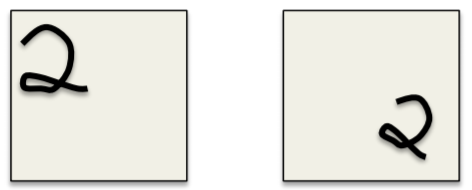
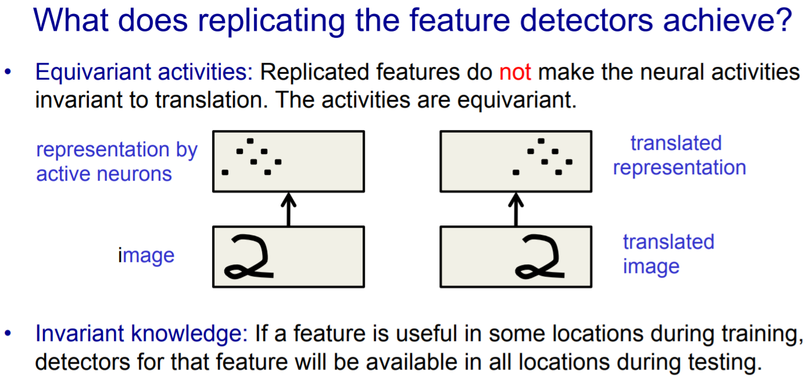

CNN
=====
object recogonition遇到的困难
-------------------------------
（来自hinton lecture5）从现实图片本身出发找，在object recognition遇到的困境（可能导致了识别精度不高）：

1. 如果直接把图片的每一个像素点作为一个input unit，"weight matrix" of "neural network with full connection"的维数太大，导致计算困难。

2. 由viewpoint changes产生的"dimension hopping"，见下图。一侧的手写2由另一侧旋转(Rotate)和平移(Translate)而来，the dimensions that contain "2" are different which have been moved to other dimensions. 手写时，这种情况很普遍，并且training set 不可能穷尽所有的"viewpoint changes"。如果用左侧的图片来训练，是否可以识别出右侧的图片？

3. Deformation。a hand-written 2 can have a large loop or just a cusp（尖头），这两种情况都属于2的“手写形变”。每个人的字迹不一样，这也是普遍现象，但是training set不可能穷尽所有形变。用前者作为训练数据，神经网络可否识别出后者？

为什么用CNN进行对象识别以及CNN带来的好处
----------------------------------------------
用CNN进行对象识别原因更多从对象本身的特点以及识别难点出发，然而，CNN带来的好处更多从计算的便利性出发，两者相互区别又相互联系的议题。

CNN的神经科学解释
^^^^^^^^^^^^^^^^^^^^
下面的科学解释是设计CNN的"prior knowledge"(先验知识)

1. 1959年，Hubel和Wiesel的实验表明生物的视觉处理是从简单的形状开始的，比如边缘，直线，曲线，并凭借这一发现获得了诺贝尔奖。——CNN有多层卷积层，后面的层都会抽象组合成更高阶（全局些）的特征，保留了图像的空间信息，保持特征的空间不变性。

2. 19世纪60年代，科学家通过对猫的视觉皮层细胞研究发现，每一个视觉神经元只会处理一小块区域的视觉图像，即感受野（Receptive Field）。——卷积神经网络的概念即出自于此。

3. 图像的空间联系也是局部的像素联系较为紧密，而距离较远的像素相关性则较弱。

Why CNN
^^^^^^^^^^
1. replicated feature approach针对上述的“困难2”。下图中，active neurons实现了和image translation(平移)的同变。那么，这种同变性是对训练好，还是对识别好？

CNN的好处
^^^^^^^^^^^^^^^
1. 避免了对图像的复杂前期预处理，可以直接输入原始图像。
2. 局部连接（Local Connection）和权值共享（Weight Sharing）减少了计算量

.. _component_of_a_convoluntional_layer:

基本概念
---------
1. 卷积核:feature detector
2. 通道：每个卷积核都会将图像生成另一幅图像，后者称为“通道”或者“特征”或者"feature map"
3. replicated feature approach: use many diffrent copies of the same feature detector with **different positions**.
4. CNN中的“C”，应该是代表了replicated feature approach。把图像的多维数据摊开到一维，移动卷积核，与图像数据相乘求和，这种计算过程，和两个离散信号求卷积的过程相同。

Graph（网络结构）
--------------------
典型的CNN由如下三个部分级联而成：

1. 卷积层（卷积+池化）

在进入“全连接层”之前，找出合适的features数以代表原始图片作为“全连接层”的输入。虽然降维了，但是也不能太少，否则无法代表原始图片。

2. 全连接层，得到固定长度的特征向量
3. softmax，进行分类

定义Graph的流程
^^^^^^^^^^^^^^^^^^
1. 用tf.placeholder()定义整个CNN **4-D input** of shape [batch, in_height, in_width, in_channels]
2. 用tf.Variable()定义卷积层使用的 **4-D weight** of shape [filter_height, filter_width, in_channels, out_channels] and **1-D bias** of shape [out_channels]
#. 定义单卷积层的组件: conv operation, pool operation...
#. 用单层（第1层）的参数，包括卷积核的尺寸和个数，还有卷积和池化的步长等初始化weight、bias和conv/pool operation，把input等连起来，定义单层卷积层
#. 把上一层的output作为input，重复上一步，定义下一层卷积
#. 定义全连接层、Dropout层和Softmax层

卷积层
-------
每个卷积层要完成两个操作：

1. 抽取特征
2. 抗形变(deformation)

How to 抽取特征
^^^^^^^^^^^^^^^^
1. 一个卷积核的输出的意义是，一副图在不同位置的相同特征（replicated feature approach）
2. 一副图在相同位置的不同特征，分散在不同卷积核输出的相同位置。

How to 抗形变
^^^^^^^^^^^^^^^^

形变：a hand-written 2 can have a large loop or just a cusp（尖头），这两种情况都属于2的“手写形变”

1. 激活函数

激活函数本身就是 :ref:`neuron model <neuron>` 的一部分，不是从属于CNN或者是RNN。

2. 池化

池化简单来说就是将输入图像切块，大部分时候我们选择不重叠的区域，再取切分区域中所有值的均值或最大值作为代表该区域的新值，放入池化后的二维信息图中。

池化操作和卷积操作很类似，都存在kernel_size和stride两个重要参数，池化可以理解为卷积核都为1的卷积。

池化的作用
^^^^^^^^^^
1. 抗形变

e.g. a hand-written 2 can have a large loop or just a cusp（尖头），这两种情况都属于2的“手写形变”

2. 降维

图像经过多核卷积后，dimension往往会增加,见hinton, Lecture 5a, LeNet5。pooling会减少下一层"feature extraction"的输入数量，所以，在下一个"feature extraction layer"能有更多不同的"feature mpas"，例如，在MTCNN和LeNet5的网络结构图中，后面的卷积层往往拥有比前面的更多的卷积核。

3. （副作用）丢失物体的精准位置信息，在一些识别场景——需要用到"precise spatial relationship between high-level parts"中，就有问题。例如，识别眼睛和鼻子

卷积层的层数
^^^^^^^^^^^^^
较浅的卷积层（靠前的）的感受域比较小，学习感知细节部分的能力强，较深的隐藏层 (靠后的)感受域相对较大，适合学习较为整体的、相对更宏观一些的特征。

Padding
^^^^^^^^^
padding的本意是“填充”，在tf的卷积和池化函数中，都会出现padding这个参数，且参数值都是二选一，"VALID","SAME"，会对卷积和池化操作的输出的图片的尺寸产生影响, `Rerfence <http://blog.csdn.net/jasonzzj/article/details/53930074>`_ 中有计算公式。

- padding="VALID", 卷积核和池化核的右侧移出图像矩阵区域，操作终止
- padding="SAME", 卷积核和池化核的左侧移出图像矩阵区域，操作终止

.. _dropout:

Dropout
----------
Usage
^^^^^^^^
AlexNet首次在最后的几个全连接层使用了Dropout

在《tensorflow实战》ch5，Dropout层用在了全连接层的后面，softmax之前。

Intro
^^^^^^^
下面的链接很好的解释了Dropout的概念及其本质。
http://www.jianshu.com/p/c9f66bc8f96c

`this article <http://blog.csdn.net/u012162613/article/details/44261657>`_ 中的“Dropout”部分讲的很好