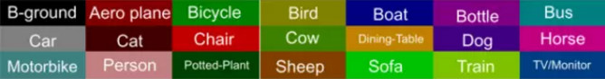

.. _FCN-label:

FCN
=====

背景和数据集
-------------------
2015年，在CVPR会议上提出FCN，使用的识别库是 PASCAL VOC，在 PASCAL VOC 中有 20种物体分类，另外一个 background 分类，一个分类对应一种颜色，一共有21种颜色。

FCN v.s. CNN
--------------

FCN把CNN中最后的“全连接层”全部转化为1*1的卷积核的卷积层。

CNN 的输入是图像，输出是一个一维向量，表示此输入图像属于每个分类的概率值。

FCN的输入是一张图片（H*W*3），输出也是一张同像素的图片（H*W），并且在输出图像上有信息标注，指明每一个像素可能是什么物体 / 类别。

Network Structure
-------------------
1. 卷积层（下采样）
2. 反卷积层（上采样）

FCN不足
---------
精度问题，对细节不敏感，以及像素与像素之间的关系，忽略空间的一致性等问题。