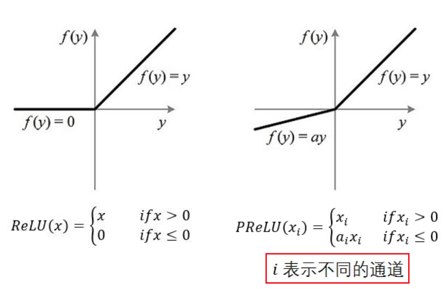
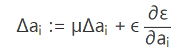
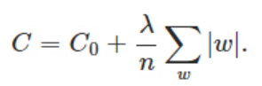
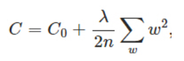

Neural Network
================
.. _neuron:

Neuron Model
-------------
根据neuron的激励函数（activation function）不同，常见的neuron model如下。需要根据使用场景选择不同的激活函数或者神经元。

Why Use Activation Functions
^^^^^^^^^^^^^^^^^^^^^^^^^^^^^^
- 非线性： 当激活函数是线性的时候，一个两层的神经网络就可以逼近基本上所有的函数了。但是，如果激活函数是恒等激活函数的时候（即f(x)=x），就不满足这个性质了，而且如果MLP使用的是恒等激活函数，那么其实整个网络跟单层神经网络是等价的。
- 可微性： 当优化方法是基于梯度的时候，这个性质是必须的。
- 单调性： 当激活函数是单调的时候，单层网络能够保证是凸函数。
- f(x)≈x： 当激活函数满足这个性质的时候，如果参数的初始化是random的很小的值，那么神经网络的训练将会很高效；如果不满足这个性质，那么就需要很用心的去设置初始值。
- 输出值的范围： 当激活函数输出值是 有限 的时候，基于梯度的优化方法会更加 稳定，因为特征的表示受有限权值的影响更显著；当激活函数的输出是 无限 的时候，模型的训练会更加高效，不过在这种情况小，一般需要更小的learning rate.

Sigmoid Neuron
^^^^^^^^^^^^^^^^

ReLU
^^^^^^^^^^^^^^^^^^^^^^^^^
Rectified Linear Neuron

PReLU
^^^^^^
Parametric Rectified Linear Unit，增加了参数修正的ReLU，来自于论文 `Delving Deep into Rectifiers:Surpassing Human-Level Performance on ImageNet Classification <https://arxiv.org/pdf/1502.01852.pdf>`_

- 在MTCNN的PNet中使用了这个激励函数。
- 注意图中通道的概念，不同的通道对应不同的a :subscript:`i`
- 如果 ai=0，那么 PReLU 退化为 ReLU；如果 ai 是一个很小的固定值（如ai=0.01），则 PReLU 退化为 Leaky ReLU（LReLU）。 有实验证明，与 ReLU 相比，LReLU 对最终的结果几乎没什么影响。
- ReLU只增加了极少量的参数，也就意味着网络的计算量以及过拟合的危险性都只增加了一点点。特别的，当不同 channels 使用相同的 ai 时，参数就更少了。
- 对于任何新增的参数都会涉及两个问题，一是初始化，二是在整个计算过程中是否会变化
- 整个论文，ai 被初始化为 0.25。
- BP 更新 ai 时，采用的是带动量的更新方式（类似于learning rate），如下图：

上式的两个系数分别是动量和学习率。
需要特别注意的是：更新 ai 时不施加权重衰减（L2正则化），因为这会把 ai 很大程度上 push 到 0。事实上，即使不加正则化，试验中 ai 也很少有超过1的。

Linear Neuron
^^^^^^^^^^^^^^^
Loss
++++++++++++++++
Euclidean(欧几里德) loss

Softmax Group
^^^^^^^^^^^^^^^^
Activation function
++++++++++++++++++++

Loss
++++++++++++++++
一个softmax group包括多个neurons，它们作为一个整体的loss称为“Cross Entropy(互熵)”。

.. image:: img/softmax-loss-1.jpg

首先L是损失。Sj是softmax的输出向量S的第j个值，前面已经介绍过了，表示的是这个样本属于第j个类别的概率。yj前面有个求和符号，j的范围也是1到类别数T，因此y是一个1*T的向量，里面的T个值，而且只有1个值是1，其他T-1个值都是0。那么哪个位置的值是1呢？答案是真实标签对应的位置的那个值是1，其他都是0。所以这个公式其实有一个更简单的形式：

.. image:: img/softmax-loss-2.jpg

当然此时要限定j是指向当前样本的真实标签。

来举个例子吧。假设一个5分类问题，然后一个样本I的标签y=[0,0,0,1,0]，也就是说样本I的真实标签是4，假设模型预测的结果概率（softmax的输出）p=[0.2,0.3,0.4,0.6,0.5]，可以看出这个预测是对的，那么对应的损失L=-log(0.6)，也就是当这个样本经过这样的网络参数产生这样的预测p时，它的损失是-log(0.6)。那么假设p=[0.2,0.3,0.4,0.1,0.5]，这个预测结果就很离谱了，因为真实标签是4，而你觉得这个样本是4的概率只有0.1（远不如其他概率高，如果是在测试阶段，那么模型就会预测该样本属于类别5），对应损失L=-log(0.1)。那么假设p=[0.2,0.3,0.4,0.3,0.5]，这个预测结果虽然也错了，但是没有前面那个那么离谱，对应的损失L=-log(0.3)。我们知道log函数在输入小于1的时候是个负数，而且log函数是递增函数，所以-log(0.6) < -log(0.3) < -log(0.1)。简单讲就是你预测错比预测对的损失要大，预测错得离谱比预测错得轻微的损失要大。

Network Construction
-----------------------

Network Cost Function
------------------------
Definition
^^^^^^^^^^^^
- output layer的neuron model的cost function是整个神经网络的loss的主要组成部分
- 对于mini batch learning method而言，整个神经网络的cost function被定义为“mini batch中每个sample的loss的均值”，e.g.

（from Andrew Ng Week6）

.. image:: img/cost-func.png

.. _error-surface:

Error Surface
^^^^^^^^^^^^^^^
在Hilton和Andrew的课中，多次提及这个概念。下图就是一个linear neuron的error surface的垂直截面图和水平截面图，水平轴是each weight，垂直轴是error。

.. image:: img/nn-1.png

从上图可得：

- 梯度下降法的作用就是不断调整参数，使得模型的误差由“碗沿”降到“碗底”，参数由椭圆外部移动到椭圆的中心附近。
- weights每一个分量的变化(**gradient descent**)的矢量和就是cost function收敛的方向

OHEM(Online Hard Sample Mining)
^^^^^^^^^^^^^^^^^^^^^^^^^^^^^^^^^^
在MTCNN的face/nonface classification task中，使用了这个概念对训练的loss进行修改。

Hard Sample&Easy Sample
++++++++++++++++++++++++
有一篇论文详述了 `SAMPLE IMPORTANCE IN TRAINING DEEP NEURAL
NETWORKS <https://openreview.net/pdf?id=r1IRctqxg>`_

Generalization
---------------
How To Judge
^^^^^^^^^^^^^^
有很多防止overfit的方法，但是首先要判断是否发生了overfit，并辨别成因，使用对应的解决方法。

显然，只有把train set和validation set的cost function曲线放在一起，才能判断是否发生了ovefit。

L1 Regularization
^^^^^^^^^^^^^^^^^^^

L2 Regularization
^^^^^^^^^^^^^^^^^^^

Dropout
^^^^^^^^^
详见 :ref:`CNN-Dropout <dropout>`

.. _data-aug:

Data Augmentation
^^^^^^^^^^^^^^^^^^
`this article <http://blog.csdn.net/u012162613/article/details/44261657>`_ 中的“数据集扩增”部分讲的很好，还有相关论文，暂时没有时间看。

`the article <https://zhuanlan.zhihu.com/p/31761796>`_ 详述了MTCNN中data augmentation的过程

Training
----------
Definition
^^^^^^^^^^^^
其实，神经网络的训练过程就是使用Optimization Algorithm最小化Loss的过程。

使用NN的一般流程
------------------
1. 准备数据

2. 设计网络结构(:ref:`Graph Level in TF <programming-model>`)

- 根据training data set, 设计网络的 **input layer** 和 **output layer**
- 根据应用场景设计 **hidden layer** , e.g. :ref:`How To Define CNN Graph <component_of_a_convoluntional_layer>`

3. 定义cost function

- cost function往往由整个CNN中最后一层的形态和意义来决定
- 最好加入 penalty factor——λ，以免过拟合

4. 定义使cost function最小化的优化算法

需要设置一个参数learning rate，用于余梯度下降时控制下降的速率。

5. 定义评估操作
6. Train Model

- 迭代地对数据进行训练

7. 在全部训练完成之后，在最终的测试集上进行全面的测试

应用场景
--------------
用神经网络可以解决

- 分类问题
- 回归问题

图像语义分割
^^^^^^^^^^^^^
图像的语义分割是像素级别的分类问题

《语义分割中的深度学习方法全解：从FCN、SegNet到各代DeepLab》
https://zhuanlan.zhihu.com/p/27794982

《十分钟看懂图像语义分割技术》
https://www.leiphone.com/news/201705/YbRHBVIjhqVBP0X5.html