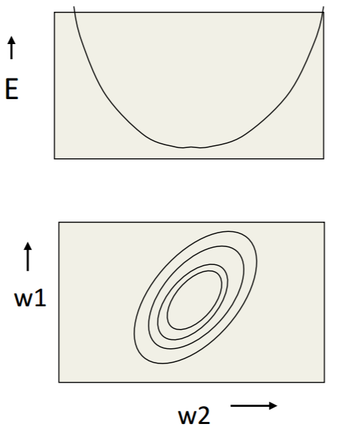
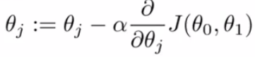
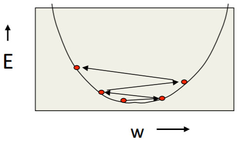

Neural Network
================
Neuron Model
-------------
根据neuron的activation function不同，常见的neuron model有:

Sigmoid Neuron
^^^^^^^^^^^^^^^^

Rectified Linear Neuron
^^^^^^^^^^^^^^^^^^^^^^^^^

Linear Neuron
^^^^^^^^^^^^^^^

Learning method
-----------------
对于神经网络而言，有两种常用的学习方法：

- full-batch method
- mini-batch method

Cost Function
----------------
整个神经网络的cost function由最后一层的neuron model决定。例如，linear neuron和softmax neuron的loss function有很大的区别

Error Surface
^^^^^^^^^^^^^^^
在Hilton和Andrew的课中，多次提及这个概念。下图就是一个linear neuron的error surface的垂直截面图和水平截面图，水平轴是each weight，垂直轴是error。

从上图可得：

- weights每一个分量的变化(**gradient descent**)的矢量和就是cost function收敛的方向

Cross Entropy(互熵)
^^^^^^^^^^^^^^^^^^^^^^

Optimization Algorithm
-------------------------
最优算法就是让cost function最小化的算法，算法中所有考虑因素的落脚点只有两个：

- 学习速度/收敛速度
- 收敛结果：全局最小值/局部最小值

Learning Rate
^^^^^^^^^^^^^^^
根据Gradient discent的公式，

learning rate的取值大小通过直接影响Weights，进而影响cost function的收敛性，无法兼顾学习速度和收敛结果(是否成功找到cost function的最小值)。

- weights在 **error surface** 中的移动方式，会影响收敛速度和收敛结果
- learning rate太大，就湮没了不同weights分量的梯度的不同，因为是 **learing-rate * gradient**，进而导致收敛速度降低

+-------------+-------------------------------------------------------------------+--------------+-----------------+
|             |                               error                               | convergence  |   convergence   |
|             |                                                                   |     speed    |      result     |
+-------------+-------------------------------------------------------------------+--------------+-----------------+
| turn down α | reduce the random fluctuations(随机波动)in the error              | slower       | get a quick win |
|             | due to the different gradients on different mini-batch            |              |                 |
+-------------+-------------------------------------------------------------------+--------------+-----------------+
| turn up α   | weighs slosh to and fro(来回摇摆) across the ravine(峡谷)，如下图 | quick        | failed          |
+-------------+-------------------------------------------------------------------+--------------+-----------------+

Initializing the Weights
^^^^^^^^^^^^^^^^^^^^^^^^^

SGD
^^^^^^
1. 随机梯度下降，Stochastic Gradient Descent，又可以称为mini-batch gradient descent
2. 使用一小部分样本进行训练
#. 利用了highly redundant dataset。例如，mnist training set只有55000个样本，下面的例子却使用总数为100万的训练样本数量

.. code-block:: python
  :linenos:

  #return an operation
  train_step = tf.train.GradientDescentOptimizer(learning-rate).minimize(loss-function)
  for i in range(20000):
    batch = mnist.train.next_batch(50)
    train_step.run(feed_dict={x:batch[0], y_:batch[1]})
    

传统的梯度下降
^^^^^^^^^^^^^^^
每次使用全部样本进行训练

使用NN的一般流程
------------------
1. 准备数据

2. 根据training data set, 设计网络结构—— :ref:`Graph Level <programming-model>`

- :ref:`How To Define CNN Graph <component_of_a_convoluntional_layer>`

3. 定义loss function

- loss function往往由整个CNN中最后一层的形态和意义来决定
- 最好加入 penalty factor——λ，以免过拟合

4. 定义使loss function最小化的优化算法

需要设置一个参数learning rate，用于余梯度下降时控制下降的速率。

5. 定义评估操作
6. Train Model

- 迭代地对数据进行训练

7. 在全部训练完成之后，在最终的测试集上进行全面的测试

应用场景
--------------
用神经网络可以解决

- 分类问题
- 回归问题

图像语义分割
^^^^^^^^^^^^^
图像的语义分割是像素级别的分类问题

《语义分割中的深度学习方法全解：从FCN、SegNet到各代DeepLab》
https://zhuanlan.zhihu.com/p/27794982

《十分钟看懂图像语义分割技术》
https://www.leiphone.com/news/201705/YbRHBVIjhqVBP0X5.html