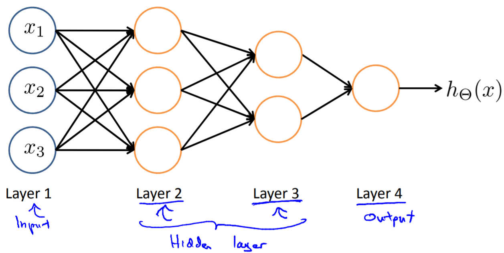
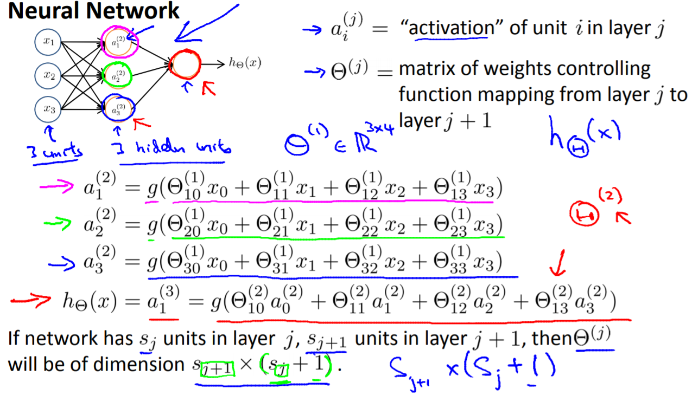
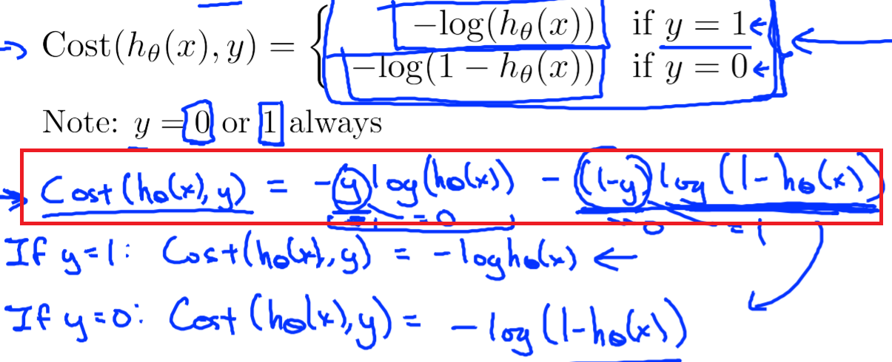

Neural Network
================
大脑神经网络的结构
------------------
`The synapse <https://www.khanacademy.org/science/biology/human-biology/neuron-nervous-system/a/the-synapse>`_

.. _neuron:

基本概念
---------
1. layer

2. 每个neuron的activate，weight matrix, bias的写法和意义

Three Network Architectures
-----------------------------
from hilton week2

这三种网络结构和三种学习方式是否有对应关系？

网络结构设计
^^^^^^^^^^^^^

1. 一般默认，1 hidden layer, or >1 hidden layer, have same no. of hidden units in every layer(usually the more the better)

Backpropagation Algorithm
---------------------------
这一小节的内容摘自Andrew Ng Week5 p24b-24c, p34-36

神经网络求解weight matrix面临的问题
^^^^^^^^^^^^^^^^^^^^^^^^^^^^^^^^^^^^^
对于神经网络（hidden layer>=1）而言，求得整个网络的loss对每一层的每一个 θ :subscript:`ij` 的偏导数，就无法用与在机器学习中所用到的相同的方法求得了。BP算法就是为求这个偏导数而生的。

BP算法的思想
^^^^^^^^^^^^
1. forward propagation求得last layer的"error values"；
2. （这一步体现了BP的精髓）由last layer的"error values"进行backpropagation，求得L-1, L-2,...2层的"error values"；
3. 由layer j的"error values"求得layer j-1 to layer j的 **accumulated gradients**,Δ, j=2,...L
4. 对每一个training data计算1-3步
5. 由Δ求得梯度。

weight matrix initialization
^^^^^^^^^^^^^^^^^^^^^^^^^^^^^^^
详见 Andrew Ng week5 p30

1. 初值的取值范围
2. dimension of weight matrix from layer j to layer j+1
3. weight matrix的计算公式

BP算法的弱点
^^^^^^^^^^^^^^^
1. 梯度弥散（vanishing gradient problem）

当使用反向传播方法计算导数的时候，随着网络的深度的增加，反向传播的梯度（从输出层到网络的最初几层）的幅度值会急剧地减小。结果就造成了整体的损失函数相对于最初几层的权重的导数非常小。这样，当使用梯度下降法的时候，最初几层的权重变化非常缓慢，以至于它们不能够从样本中进行有效的学习。

例如，在AlexNet中，使用ReLU neuron替代了sigmoid neuron，成功解决了Sigmoid在网络较深时的梯度弥撒问题。

Construct a NN in TF
---------------------------

Network Cost Function
------------------------
Summary
^^^^^^^^^^^^
- output layer的neuron model决定了整个神经网络的loss的计算方式
- 对于mini/full batch learning method而言，整个神经网络的cost function被定义为“batch中每个sample的loss的均值”，见《tf实战》p90函数loss()中使用了tf.reduce_mean()
- 如果网络loss的定义中是几个项相加，TF采用的方法是先定义各个子项，然后加起来。例如，对卷积网络中全链接层的weight进行regularization时（除去卷积层和softmax层的weight），是如何处理的，《tf实战》5.2

回归场景的loss
^^^^^^^^^^^^^^^^^^^^
Euclidean(欧几里德) loss

（from Andrew Ng Week6）

.. image:: img/cost-func.png

二分类场景的loss
^^^^^^^^^^^^^^^^^^^^
使用sigmoid neuron作为output layer

多分类场景的loss
^^^^^^^^^^^^^^^^^^^^
使用softmax作为神经网络最后一层输出，在testing set上计算的是“准确率”，而非loss。

loss when trainning
+++++++++++++++++++++
一个softmax group包括多个neurons，它们作为一个整体作为output layer时的loss称为“Cross Entropy(互熵)”。下图是“一条训练数据”的loss计算方法。

.. image:: img/softmax-loss-1.jpg

首先L是损失。Sj是softmax的输出向量S的第j个值，前面已经介绍过了，表示的是这个样本属于第j个类别的概率。yj前面有个求和符号，j的范围也是1到类别数T，因此y是一个1*T的向量，里面的T个值，而且只有1个值是1，其他T-1个值都是0。那么哪个位置的值是1呢？答案是真实标签对应的位置的那个值是1，其他都是0。所以这个公式其实有一个更简单的形式：

.. image:: img/softmax-loss-2.jpg

当然此时要限定j是指向当前样本的真实标签。

来举个例子吧。假设一个5分类问题，然后一个样本I的标签y=[0,0,0,1,0]，也就是说样本I的真实标签是4，假设模型预测的结果概率（softmax的输出）p=[0.2,0.3,0.4,0.6,0.5]，可以看出这个预测是对的，那么对应的损失L=-log(0.6)，也就是当这个样本经过这样的网络参数产生这样的预测p时，它的损失是-log(0.6)。那么假设p=[0.2,0.3,0.4,0.1,0.5]，这个预测结果就很离谱了，因为真实标签是4，而你觉得这个样本是4的概率只有0.1（远不如其他概率高，如果是在测试阶段，那么模型就会预测该样本属于类别5），对应损失L=-log(0.1)。那么假设p=[0.2,0.3,0.4,0.3,0.5]，这个预测结果虽然也错了，但是没有前面那个那么离谱，对应的损失L=-log(0.3)。我们知道log函数在输入小于1的时候是个负数，而且log函数是递增函数，所以-log(0.6) < -log(0.3) < -log(0.1)。简单讲就是你预测错比预测对的损失要大，预测错得离谱比预测错得轻微的损失要大。

Implementation in TF when training：
《tf实战》p90 def loss()

loss when testing
++++++++++++++++++++++++++++
《tf实战》p91 tf.nn.in_top_k()

.. _error-surface:

Error Surface&等高线
^^^^^^^^^^^^^^^^^^^^^
- 在Hilton和Andrew的课中，多次提及这个概念。
- 在图中，可以看出weights的运行轨迹。
- 下图就是一个linear neuron的error surface的垂直截面图和水平截面图，水平轴是each weight，垂直轴是error。

.. image:: img/nn-1.png

从上图可得：

- 梯度下降法的作用就是不断调整参数，使得模型的误差由“碗沿”降到“碗底”，参数由椭圆外部移动到椭圆的中心附近。
- weights每一个分量的变化(**gradient descent**)的矢量和就是cost function收敛的方向

OHEM(Online Hard Sample Mining)
^^^^^^^^^^^^^^^^^^^^^^^^^^^^^^^^^^
在MTCNN的face/nonface classification task中，使用了这个概念对训练的loss进行修改。

Hard Sample & Easy Sample
+++++++++++++++++++++++++++
有一篇论文详述了 `SAMPLE IMPORTANCE IN TRAINING DEEP NEURAL
NETWORKS <https://openreview.net/pdf?id=r1IRctqxg>`_

使用NN的一般流程
------------------
1. 准备数据

2. 设计网络结构(:ref:`Graph Level in TF <programming-model>`)

- 根据training data set, 设计网络的 **input layer** 和 **output layer**
- 根据应用场景设计 **hidden layer** , e.g. :ref:`How To Define CNN Graph <component_of_a_convoluntional_layer>`

3. 定义cost function

- cost function往往由整个CNN中最后一层的形态和意义来决定
- 最好加入 penalty factor——λ，以免过拟合

4. 定义使cost function最小化的优化算法

需要设置一个参数learning rate，用于余梯度下降时控制下降的速率。

5. 定义评估操作
6. Train Model

- 迭代地对数据进行训练

7. 在全部训练完成之后，在最终的测试集上进行全面的测试

应用场景
--------------
用神经网络可以解决

- 分类问题
- 回归问题

图像语义分割
^^^^^^^^^^^^^
图像的语义分割是像素级别的分类问题

《语义分割中的深度学习方法全解：从FCN、SegNet到各代DeepLab》
https://zhuanlan.zhihu.com/p/27794982

《十分钟看懂图像语义分割技术》
https://www.leiphone.com/news/201705/YbRHBVIjhqVBP0X5.html