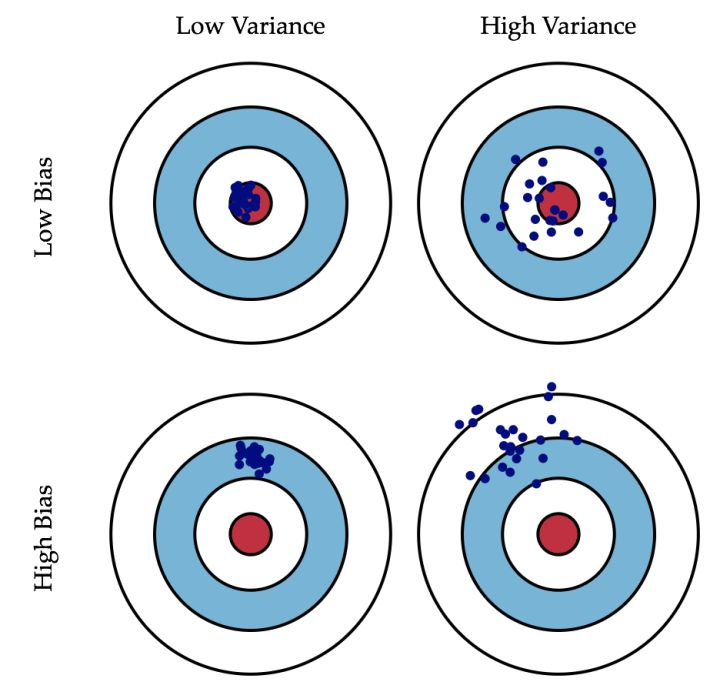
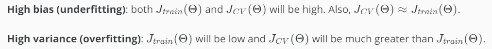
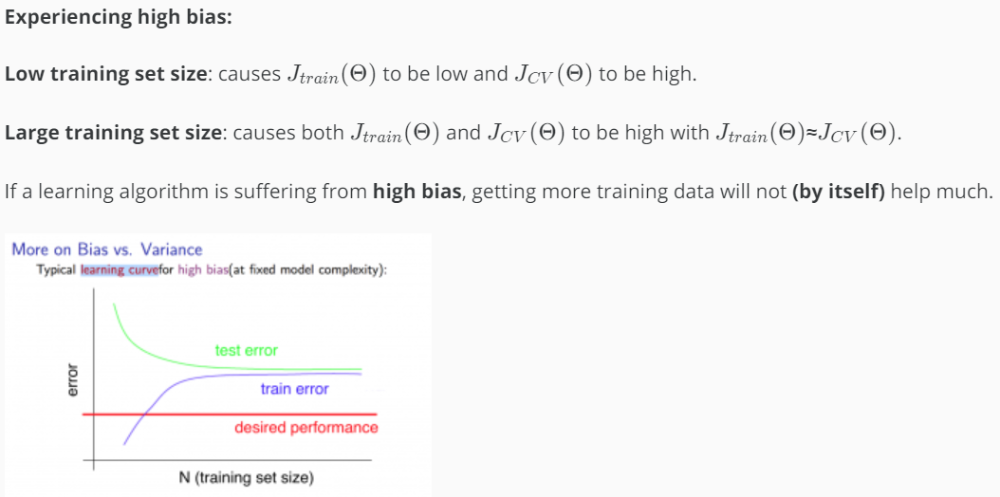
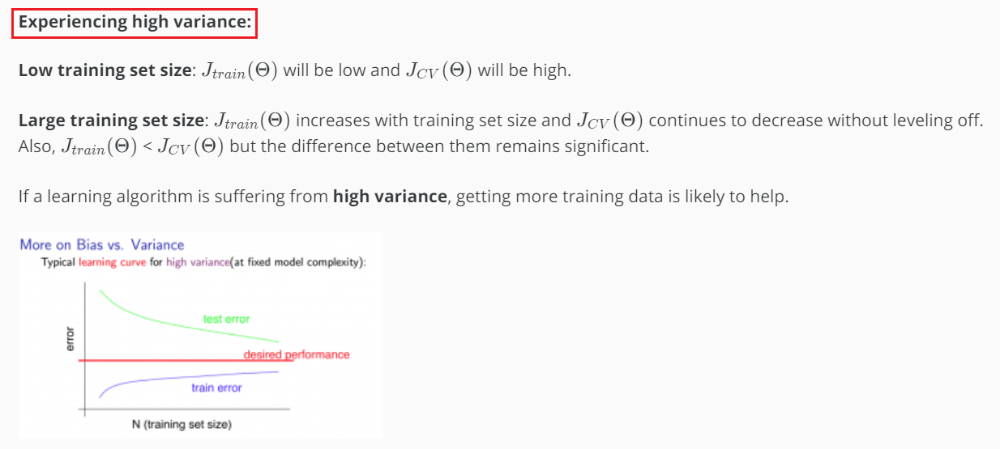

Bias v.s. Variance
=======================
用J :subscript:`train` (Θ)的绝对值衡量bias, 用J :subscript:`train` (Θ)和J :subscript:`cv` (Θ)的相对值衡量variance。

Definition
-------------
偏差：描述的是预测值（估计值）的期望与真实值之间的差距。偏差越大，越偏离真实数据，如下图第二行所示。

方差：描述的是预测值的变化范围，离散程度，也就是离其期望值的距离。方差越大，数据的分布越分散，如下图右列所示。

Overfitting and Underfitting
----------------------------------
- Over fitting occurs when the model captures the noise(噪音) and the outliers(离群值) in the data along with the underlying pattern. These models usually have **high variance and low bias**. These models are usually complex like Decision Trees, SVM or Neural Networks which are prone to over fitting.

- Under fitting occurs when the model is unable to capture the underlying pattern of the data. These models usually have **a low variance and a high bias**. These models are usually simple which are unable to capture the complex patterns in the data like Linear and Logistic Regressions.

High Bias or High Virance
--------------------------------
方法1
^^^^^^^^^^
第1步，learn parameter θ from **training set**
    
    对于回归问题，使用的learning target如下图所示

    .. image:: img/regression_target.png

第2步，待模型训练结束后，compute J :subscript:`train` (Θ) from **training set** and J :subscript:`cv` (Θ) from **cross validation set**

    - 对于回归问题, 公式如下图，注意，其中没有"L2 Regularization"

    .. image:: img/regress_train_cv.png

    - 对于分类问题，J :subscript:`train` (Θ)和J :subscript:`cv` (Θ)既可以用“互熵”，也可以用"Misclassification error"来计算，例如下图的“二分类”计算公式：

    .. image:: img/classfication_traing_cv_error.png

第3步，比较J :subscript:`train` (Θ)和J :subscript:`cv` (Θ)的值to select the model

针对high bias或者high variance来调整模型。但是，要注意的是，调整的点不同，J :subscript:`train` (Θ)和J :subscript:`cv` (Θ)的变化趋势也不同。

    - 调整模型复杂度

    .. image:: img/complexity.png

    - 调整regularization parameter

    .. image:: img/reg_train_cv.png

第4步，estimate generalization error for **test set** using J :subscript:`test` (Θ)

方法2 Learning Curve
^^^^^^^^^^^^^^^^^^^^^^^^^^^
STEP 1, 确定好model and learning target(cost function)

STEP 2, 从"training set"中选出“数据量逐步增长的子集(training subset)”，针对每个"training subset", 完成3小步，

    (1) minimize the learning target to learn parameter θ on the training subset

    (2) 计算J :subscript:`train` (Θ) on the training subset

    (3) 计算J :subscript:`cv` (Θ) on the validation set

STEP3, 画图判断high bias or high variance

