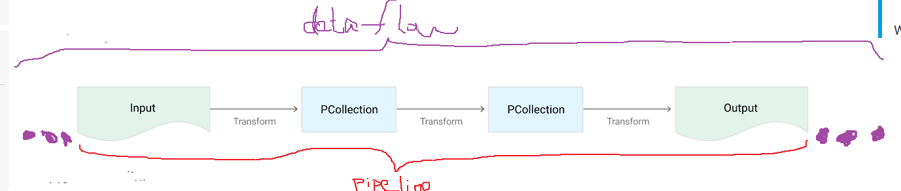
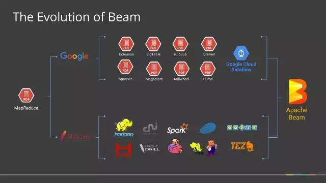

Dataflow Programming Model
============================
What is Dataflow Programming
-----------------------------
models a program as a directed graph of the data flowing between operations

Why dataflow graph
-------------------
- parallel computing
- large-scale data processing

Four Concepts about Dataflow
-----------------------------
`details of four major concepts on Google Cloud Platform <https://cloud.google.com/dataflow/model/programming-model>`_

- Pipelines, 等同于tf中的subgraph
- PCollections, 等同于tf中的tensor
- Transforms, 等同于tf中的node
- I/O Sources and Sinks(input source and output sink)，等同于tf中的inputing and outputing data

此四者的关系如下图所示，可见Dataflow就是由一个一个pipeline组成的：

Pipeline Design Principles
----------------------------
详见 `Pipeline Design Principles on Google Cloudplatform <https://cloud.google.com/dataflow/pipelines/design-principles>`_

请结合上文中提及的四个基本问题来认识pipeline的五种形态。

Apache Beam
--------------
2016年2月谷歌高调宣布将Apache Beam（原名Google DataFlow）贡献给Apache基金会孵化，Apache Beam被认为是继MapReduce，GFS和BigQuery等之后，谷歌在大数据处理领域对开源社区的又一个非常大的贡献。

