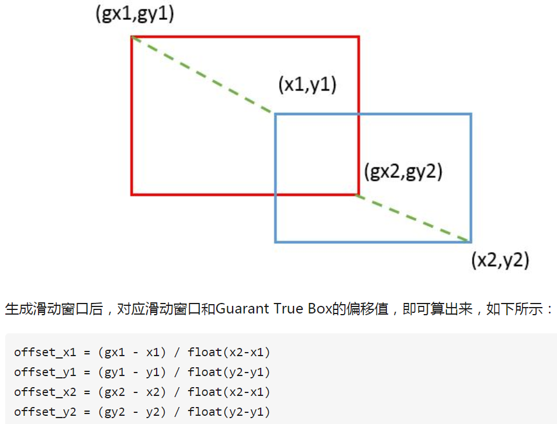
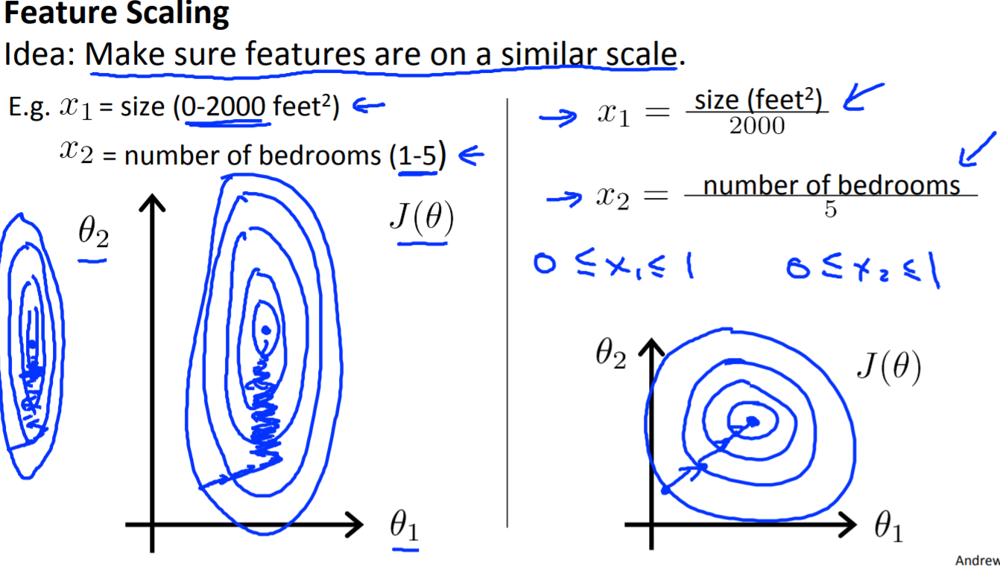
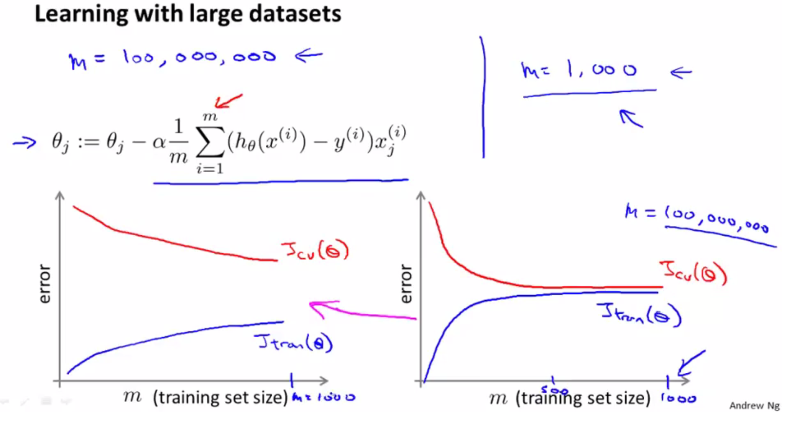
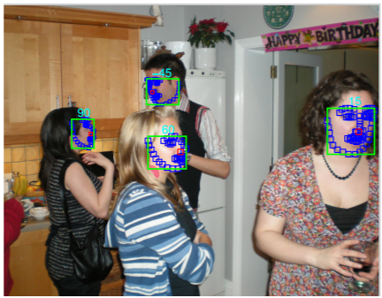
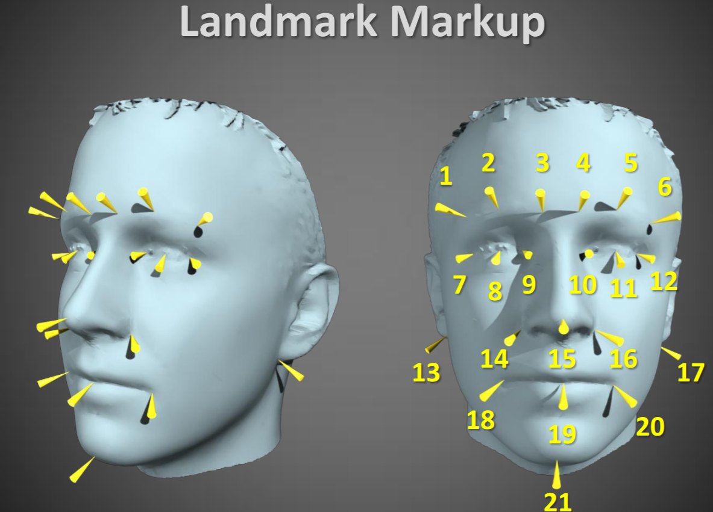

Dataset
=========
深度学习的发展和数据集的发展密不可分。某个算法的提出可能就是为了解决某个数据集的相关问题。

显然，使用了数据集的都是监督型机器学习和深度学习。

特点及影响
-----------
1. Dataset有如下三个特点：

- feature值的大小
- 数据量
- 冗余度

数据的冗余度就是features之间的相关性的大小，例如，CNN中作为直接输入的图片像素就有high redundant

2. 对learning algorithm的影响如下：

+-----------------+------------------------------------------+-------+----------------+
|                 | :ref:`learning method <learning-method>` | speed | generalization |
+-----------------+------------------------------------------+-------+----------------+
| feature值的大小 |                                          |   -   |                |
+-----------------+------------------------------------------+-------+----------------+
|  feature冗余度  |                    -                     |       |                |
+-----------------+------------------------------------------+-------+----------------+
|   数据量的多少  |                    -                     |   -   |       -        |
+-----------------+------------------------------------------+-------+----------------+

数据集的切分
-------------
把数据集分割成如下3个部分，可能是拿到数据集后的第一步操作。

- training data，在训练集上训练模型
- validation data，在验证集上检验效果并决定何时完成训练
- test data，在测试集评测模型的效果

Data Augmentation
---------------------
意义
^^^^^^
这是一个可选的步骤。

目的在不增加data set规模的前提下，采用数学方法从data set中得到更多的training set，进而改善的模型的generalization performance. 

详见本笔记中 :ref:`Neural Network-Generalization-Data Augmentation <data-aug>`

是否需要数据强化
^^^^^^^^^^^^^^^^^
存在两个场景：

1. 不augmentation，结果不理想，例如，容易overfit。在MTCNN中，对于人脸对齐这个回归任务，就需要对iou>0.65的回归框，进行mirro, inverse和rotation等操作，增加标注了landmark坐标的图片的数量。
2. 不Augmentation无法进行运算，例如，在MTCNN中，对于人脸分类这个单一任务，依据WIDER FACE数据集的annotation只有抠出人脸数据，所以必须利用滑动窗口从原始数据集中获得正样本，负样本和中间样本。

tf中对于data augmentation的支持
^^^^^^^^^^^^^^^^^^^^^^^^^^^^^^^^^^^^^
- tf.image.random_flip_left_right(),随机的水平翻转
- tf.random_crop(),随机剪切24x24大小的图片
- tf.image.random_brightness(), tf.image.random_contrast()设置随机的亮度和对比度
- tf.iamge.per_image_whitening(),对数据进行标准化

预处理
---------
“预处理”，可能是拿到数据集后的第3步操作（第2步可选）。并且，应该只需要对training set进行“预处理”。

为什么需要预处理
^^^^^^^^^^^^^^^^^^^
按照Hilton的说法，对数据进行预处理的目的是：converts an axis aligned elliptical :ref:`error surface <error-surface>` into a circular one for which the gradient points straight towards the minimum，即加快了收敛速度，如下图error surface的等高线所示。等高线的形状对 **optimization Algorithm** 的选择也会产生影响。

.. image:: img/dataset-1.png

How&Examples
^^^^^^^^^^^^^^^^

对于监督学习的training set而言，可以对features和target result都进行预处理。

预处理常用的有两种方法：

1. normalization，`归一化 <http://ufldl.stanford.edu/wiki/index.php/%E6%95%B0%E6%8D%AE%E9%A2%84%E5%A4%84%E7%90%86#.E6.95.B0.E6.8D.AE.E5.BD.92.E4.B8.80.E5.8C.96>`_ , 使得最终的数据向量落在 [0,1]或[ − 1,1] 的区间内。这种方法主要针对的是处在同一列的或者意义相同的features或者targets。

例子1，targets的归一化。MTCNN中，对于augmentation后的数据进行回归框预测时，考虑到如果直接采用坐标信息——(top-left-x, top-left-y, bottom-right-x, bottom-right-y)，进行回归框预测，网络收敛比较慢。所以在回归框预测的时候一般采用回归框的坐标偏移进行预测。从坐标公式可以看出，是针对的top-left-x, top-left-y, bottom-right-x和bottom-right-y四列的纵向计算。

例子2，features的归一化。在Andrew Ng的lecture2中，用linear regression预测房价时用到的"feature scaling"，如下图，也是针对size,"number of bedrooms"两列的数据进行纵向计算。

2. `PCA/ZCA白化 <http://ufldl.stanford.edu/wiki/index.php/%E6%95%B0%E6%8D%AE%E9%A2%84%E5%A4%84%E7%90%86#PCA.2FZCA.E7.99.BD.E5.8C.96>`_ 

例如，AlexNet对图像的RGB进行PCA，并对主成分做一个标准差为0.1的高斯扰动，增加一些噪声，让错误率下降了1%

根据不同的datasets features，每一步可以采用不同的方法, 
`REFERENCE <http://ufldl.stanford.edu/wiki/index.php/%E6%95%B0%E6%8D%AE%E9%A2%84%E5%A4%84%E7%90%86#MNIST_.E6.89.8B.E5.86.99.E6.95.B0.E5.AD.97>`_

Tips
^^^^^^
当我们开始处理数据时，首先要做的事是观察数据并获知其特性。本部分将介绍一些通用的技术，在实际中应该针对具体数据选择合适的预处理技术。例如一种标准的预处理方法是对每一个数据点都减去它的均值（也被称为移除直流分量，局部均值消减，消减归一化），这一方法对诸如自然图像这类数据是有效的，但对非平稳的数据则不然。

Large scale dataset
----------------------
Why need
^^^^^^^^^^
对于不同的low bias的算法（不会underfit），数据集越多，不同算法的Accuracy趋同。

Whether need more
^^^^^^^^^^^^^^^^^^^
Use **learning curve** (Andrew Ng)

.. _large-scale-data-ps:

Problems&Solutions
^^^^^^^^^^^^^^^^^^^^
大数据集带来的主要的计算的问题，由梯度的公式可得，算完所有的训练数据后才能求得梯度。解决的办法有两个(Andrew Ng)：

1. if train on just a thousand examples might do just as well, :ref:`stochastic gradient descent <mini-batch-method>`

可以通过画出learning curve来判断是否可以用traning set的子集来训练。如下图右图，是high bias(underfit)的情况，增加数据集也无益，所以可以采用mini batch来训练。

2. Map-reduce

常用数据集
-----------
PASCAL VOC
^^^^^^^^^^^^

Intro
+++++++
http://host.robots.ox.ac.uk/pascal/VOC/voc2012/

在这个数据集上有多个competition，数据集的annotation会随competition不同而不同。

数据集包含文件
++++++++++++++

下载的是一个tar文件，解压缩后，有5个文件夹

- JPEGImages ：17125个.jpg图片

.. image:: img/VOC-1.jpg

- Annotations ：17125个对应的.xml文件

xml文件包括图片的基本信息、图中所含object的name和bndbox等，以及该图片是否被segmented。

- SegmentationClass：2913个png文件

用于"segmentation competition" 
的class segmentation, 用颜色区分包括背景在内的21个class，相同class的不同object的颜色相同。

.. image:: img/VOC-2.png

- SegmentationObject：2913个png文件

用于"segmentation competition" 
的object segmentation,用颜色区分相同class的不同object

.. image:: img/VOC-3.png

- ImageSets

不同的competition有各自的子文件夹，其中的.txt文件写明了JPEGImages目录中的哪些图片文件用于不同的competition

1. train.txt: Training data
2. val.txt: Validation data (suggested). The validation data may be used as additional training data (see below).
3. trainval.txt: The union of train and val.
#. test.txt: Test data. The test set is not provided in the development kit. It will be released in good time before the deadline for submission of results.

Segmentation Competition
+++++++++++++++++++++++++++++++
图像的语义分割是像素级别的分类问题。

:ref:`FCN <FCN-label>`
就是2015参加"Segmentation Competition"而提出的。

AFW
^^^^^
Annotated Faces in the Wild

来自于一片论文《Face Detection, Pose Estimation, and Landmark Localization in the Wild》

虽然没有找到可以下载的页面，但是可以从论文pdf的图片中窥见一斑，联合了boundary box和landmark

AFLW
^^^^^
Home Page
+++++++++++
Annotated Facial Landmarks in the Wild(在野外有注释的面部标志)

https://www.tugraz.at/institute/icg/research/team-bischof/lrs/downloads/aflw/

需要发送email请求才能得到数据集

Features
+++++++++++
In total about 25k faces in 21997 real-world images are annotated with up to 21 landmarks per image.

FDDB
^^^^^^
Face Detection Data Set and Benchmark

Home Page
+++++++++++
http://vis-www.cs.umass.edu/fddb/

WIDER FACE
^^^^^^^^^^^^^
Intro
+++++++
WIDER FACE dataset is a face detection benchmark dataset

http://mmlab.ie.cuhk.edu.hk/projects/WIDERFace/index.html

.. image:: img/WIDER-1.jpg

Annotation
++++++++++++
标注文件的每一行的含义

[image-path left-top-X left-top-Y right-bottom-X right-bottom-Y]

其他标注文件可能存在[image-path left right up down]

Generate training set by augmentation
++++++++++++++++++++++++++++++++++++++++
`本文 <https://zhuanlan.zhihu.com/p/31761796>`_ 主要介绍人脸检测中常用的数据处理方法，包括

- Bounding Box绘制，
- IOU计算，
- 滑动窗口生成，
- 滑动窗口相对于ground truth boundary box的偏移值

Face Point Landmark
^^^^^^^^^^^^^^^^^^^^^
Home Page
+++++++++++
http://mmlab.ie.cuhk.edu.hk/archive/CNN_FacePoint.htm

Annotations
+++++++++++++
数据集中trainImageList.txt的每一行格式如下：

[图片路径][left] [right] [top] [bottom] [landmark_1_X] [landmark_1_Y] ...

lfw_5590\Aaron_Eckhart_0001.jpg 84 161 92 169 106.250000 107.750000 146.750000 112.250000 125.250000 142.750000 105.250000 157.750000 139.750000 161.750000

Generate training set by augmentation
++++++++++++++++++++++++++++++++++++++++
`本文 <https://zhuanlan.zhihu.com/p/31761796>`_ 主要介绍了人脸检测和对齐中常用的数据处理方法，包括

- 面部轮廓关键点回归值计算
- 面部轮廓关键点生成
