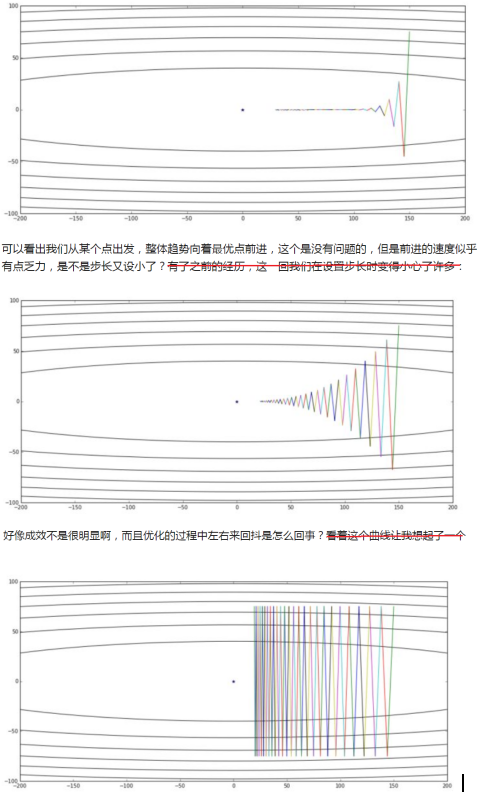
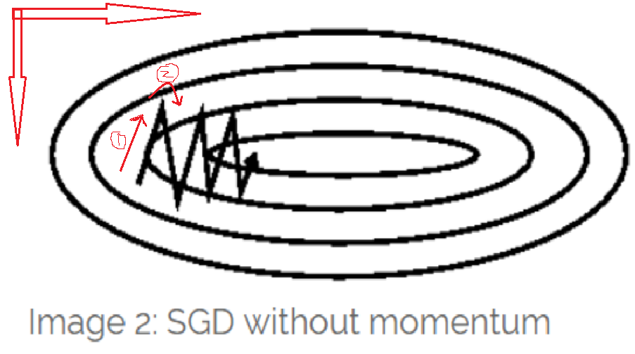

Gradient Descent
======================
Gradient descent is a way to minimize an objective function J(θ) parameterized by a model's parameters θ∈Rd by updating the parameters **in the opposite direction of the gradient** of the objective function ∇θJ(θ) w.r.t. to the parameters. 
The learning rate η determines **the size of the steps** we take to reach a (local) minimum. 
**In other words, we follow the direction of the slope of the surface created by the objective function downhill until we reach a valley.**

Gradient descent variants
------------------------------------
There are `three variants of gradient descent <http://ruder.io/optimizing-gradient-descent/index.html#gradientdescentvariants>`_, which differ in how much data we use to compute the gradient of the objective function. Depending on the amount of data, we make a trade-off between the accuracy of the parameter update and the time it takes to perform an update.

Batch gradient descent
^^^^^^^^^^^^^^^^^^^^^^^^^^^^^

Stochastic gradient descent
^^^^^^^^^^^^^^^^^^^^^^^^^^^^^^^^^^^
1. 下图来自于Andrew Ng 10th-week，是算法和error surface的等高线图

.. image:: img/nn-4.png

上图中，

- m是数据集的大小。
- Repeat内部的for循环，表示针对每条训练数据，weights都会发生改变。
- 外层的Repeat循环表示上述过程要重复的次数。

2. 下图是“迭代次数-loss”图

.. image:: img/sgd_fluctuation.png

- SGD performs frequent updates with a high variance that cause the objective function to fluctuate heavily 
- SGD's fluctuation, on the one hand, enables it to jump to new and potentially better local minima. On the other hand, this ultimately complicates convergence to the exact minimum, as SGD will keep overshooting. 
- However, it has been shown that when we slowly decrease the learning rate, SGD shows the same convergence behaviour as batch gradient descent, almost certainly converging to a local or the global minimum for non-convex and convex optimization respectively.

3. Andrew Ng week10专门讲到了“stochastic gradient descent convergence”。

- 可以每1000个点，才记录cost的值，这样"cost~No. of iterations"的图的趋势明显些。

Mini-batch gradient descent
^^^^^^^^^^^^^^^^^^^^^^^^^^^^^^^^^^
1. Mini-batch gradient descent is typically the algorithm of choice when training a neural network.
2. the term **SGD** usually is employed also when mini-batches are used. 

.. code-block:: python
  :linenos:

  #return an operation
  train_step = tf.train.GradientDescentOptimizer(learning-rate).minimize(loss-function)
  for i in range(20000):
    batch = mnist.train.next_batch(50)
    train_step.run(feed_dict={x:batch[0], y_:batch[1]})

.. _sgd-lr:

3. 画出"training set size~cost"图（在神经网络中可行），manual adjust **learning rate** to mini-batch gradient descent——write a program to automate this way

- if the error keeps getting worse or oscillates wildly, **turn down** the learning rate
- towards the end of learning it nearly always helps to **turn down** the learning rate
- Using **the error on a separate validation set**, when the error stops decreaseing, **turn down** the learning rate
- if the error is falling fairly consistently bust slow, **increase** the learning rate

4. 对于SGD,如果只是单纯的加大learning rate，1)收敛速度不一定会增加，反而可能根本无法收敛;2)gradient oscillation并没有改变。怎么办？——梯度下降的优化算法

下面3副图逐渐增加learning rate，用了一个等高线是椭圆的cost function作为取最值的对象，用等高线坐标系中weights的移动轨迹使优化的过程可视化。（ **Question**, 在神经网络中，weights参数以万计，不可能直观画出这种轨迹图）

.. _challenges-of-gd:

Challenges of These Three Gradient Descent Variants
----------------------------------------------------------
**Good convergence** 意味着“快速找到loss的全局最小值”。
`Challenges <http://ruder.io/optimizing-gradient-descent/index.html#challenges>`_ 解释了几点需要Gradient descent optimization algorithms（梯度下降优化算法）的原因。

1. 收敛速度慢

- A **learning rate** that is too small
- the same **learning rate** applies to all parameter updates

2. 无法收敛

- a **learning rate** that is too large can hinder convergence and cause the loss function to fluctuate around the minimum or even to diverge.

3. 收敛在错误值

- for neural networks, highly non-convex error functions is getting **trapped** in their saddle points(鞍点), not suboptimal local minima(非最优局部最小值). 

    **Saddle points** are points where one dimension slopes up and another slopes down. These saddle points are usually surrounded by a plateau of the same error, which **makes it notoriously hard for SGD to escape, as the gradient is close to zero in all dimensions**.

    .. image:: img/saddle-point.png

4. 从下面这幅weight在等高线的移动轨迹（在神经网络中不可能画出这样的图）

可以看出

- 箭头1的移动轨迹说明，error在纵轴的方向上倒数大（移动的分量远），而在横轴方向上倒数小（移动的分量小）
- 箭头2的移动轨迹说明，error在纵轴方向的倒数+-号变了，而在横轴方向上的倒数的正负保持一致

但是，我们期望达到的是(From Hinton Lecture 6a)：

- Move quickly in direction with small but consistent gradient(一致性梯度)
- Move slowly in direction with big but inconsistent gradient