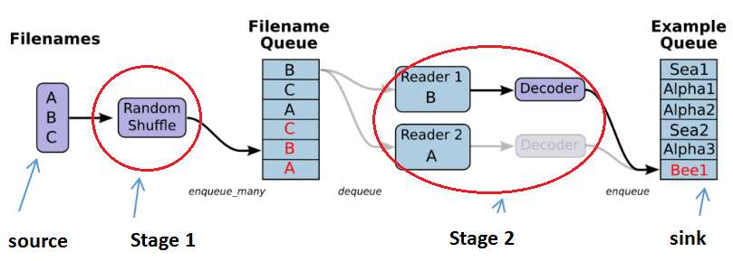

.. _importing-data:

Importing Data
================

Backgroud
----------

在《tf实战》一书中使用的都是tf已经封装好的MNIST数据，直接import就行，并且提供了丰富的访问方法，见P46

在学习mtcnn实现的数据准备阶段，negative， positive, part和landmark的图片文件和标注文件都准备好了，接下来的问题是，如何把这些成千上万的图片文件和其标注数据提交给模型来运算呢，选择不同的 :ref:`learning method <learning-method>`，就有不同的数据读取方式？

tf三种读取数据的方式
---------------------
Feeding
^^^^^^^^^
供给数据(Feeding)：定义tf.placeholder()，在tensorflow程序运行的每一步，让python代码来供给数据,e.g. opencv.imread()

Preloaded data
^^^^^^^^^^^^^^^^
预加载数据(Preloaded data)：如果数据量不太大，定义tf.Variable() or tf.constant(),可以在程序中定义常量或者变量来保存所有的数据。

.. _input-pipeline:

Input Pipeline
^^^^^^^^^^^^^^^^

在实际训练模型时，应该多会采用这种方式。

QueueRunner(Before TF 1.4)
+++++++++++++++++++++++++++++
1. Definition

QueueRunner(`Guide <https://www.tensorflow.org/api_guides/python/reading_data#_QueueRunner_>`_): **a queue-based input pipeline** reads the data from files at the beginning of a TensorFlow graph which means that **a few pipeline stages are connected by queues**.

2. 流程图

.. image:: img/AnimatedFileQueues.gif

由上面的gif流程可得，有两个主要的 :ref:`stages <pipeline-stage>`, 如下图

- The stage1 will generate filenames to read and enqueue them in the filename queue. 
- The stage2 consumes filenames (using a Reader), produces examples, and enqueues them in an example queue.

3. Construct the Pipeline

构建pipeline的过程在本质上和构建深度网络的过程是相同的。

The helpers in tf.train that create these queues and enqueuing operations add a **tf.train.QueueRunner** to the **graph** using the **tf.train.add_queue_runner function**。从MTCNN的代码中看出，tf.train.add_queue_runner() 并没有被显示的调用。

**Each QueueRunner is responsible for one stage**, and holds the list of enqueue operations that need to be run in threads. 

4. Run the Pipeline

Once the graph is constructed, the tf.train.start_queue_runners function asks each QueueRunner in the graph to start its threads running the enqueuing operations.

.. code-block:: python
	:linenos:

	coord = tf.train.Coordinator()
	threads = tf.train.start_queue_runners(sess=sess, coord=coord)
	try:
		for step in range(MAX_STEP):
			i = i + 1
			if coord.should_stop():
			    break
			image_batch_array, label_batch_array, bbox_batch_array,landmark_batch_array = sess.run([image_batch, label_batch, bbox_batch,landmark_batch])
			_,_,summary = sess.run([train_op, lr_op ,summary_op], feed_dict={input_image: image_batch_array, label: label_batch_array, bbox_target: bbox_batch_array,landmark_target:landmark_batch_array})

从上述代码可以看出：

1. 需要对input pipeline单独调用一次sess.run()，且必须先执行tf.train.start_queue_runners()
2. 生成training batch和a training iteration在traning loop的同一次iteration中，这个和tf自带的mnist的使用相同，见《tf实战》p83。

5. 从不同格式的文件读取数据

+--------------------------------------------+------------------------------+-------------------------------------+
|                  文件格式                  |            阅读器            |              记录解析器             |
+--------------------------------------------+------------------------------+-------------------------------------+
| CSV                                        | tf.TextLineReader()          | tf.decode_csv()                     |
+--------------------------------------------+------------------------------+-------------------------------------+
| tfrecord                                   | tf.TFRecordReader()          | tf.parse_single_example()           |
|                                            |                              | 将Example protocol buffer解析为张量 |
+--------------------------------------------+------------------------------+-------------------------------------+
| 固定长度的记录                             | tf.FixedLengthRecordReader() | tf.decode_raw()                     |
| e.g. the CIFAR-10 dataset,                 |                              |                                     |
| 每条记录的长度都是固定的，                 |                              |                                     |
| 一个字节的标签，后面是3072字节的图像数据。 |                              |                                     |
+--------------------------------------------+------------------------------+-------------------------------------+

tf.data API(From TF 1.4)
+++++++++++++++++++++++++++
`See guide <https://www.tensorflow.org/api_guides/python/reading_data#_tf_data_API>`_,The API can easily construct a complex input pipeline. (**preferred method**). This is **an improved version of the old input methods---feeding and QueueRunner**

两种实现的比较
+++++++++++++++++++++++++++++
Input pipeline是一个整体概念，虽然tf提供了两种实现“input pipeline”的方式，

- 但是应该都遵循了相同的设计原则和思路，可以从 :ref:`Four Concepts about Dataflow <4-dataflow>` and :ref:`four basic problems of pipeline deisgn <pipeline-design>` 来观察。
- 两种不同的"input pipeline"实现方式的区别应该在于连接stages的方式不同。
- 具体到MTCNN中，input pipeline的 `Beginning <https://www.tensorflow.org/api_guides/python/io_ops#beginning_of_an_input_pipeline>`_ "data source"就是tfrecord files，`End <https://www.tensorflow.org/api_guides/python/io_ops#batching_at_the_end_of_an_input_pipeline>`_ "data sink"就是batch。
