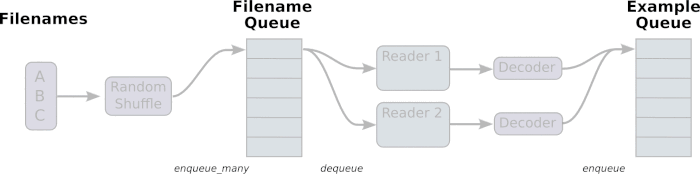

Importing Data
================

backgroud
----------
在学习mtcnn实现的数据准备阶段，negative， positive, part和landmark的图片文件和标注文件都准备好了，接下来的问题是，如何把这些文件和数据提交给模型来运算呢？

- 在《tf实战》一书中使用的都是tf已经封装好的MNIST数据，直接import就行，并且提供了丰富的访问方法，见P46
- 自有的庞大数据该如何处理？

三种读取数据的方式
------------------

- 供给数据：定义tf.placeholder()，在tensorflow程序运行的每一步，让python代码来供给数据,e.g. opencv.imread()
- 从文件（tfrecord, cvs等文件）读取数据：建立输入管线（input pipeline）从文件中读取数据，其中tfrecord是tensorflow官方推荐的标准格式，tfrecord其实是一种数据存储形式，将图像数据和标签统一存储的二进制文件。

其中，涉及到了pipeline和queue的概念，管道通信方式的中间介质是文件，通常称这种文件为管道文件。两个进程利用管道文件进行通信时，一个进程为写进程，另一个进程为读进程。写进程通过写端（发送端）往管道文件中写入信息；读进程通过读端（接收端）从管道文件中读取信息。两个进程协调不断地进行写、读，便会构成双方通过管道传递信息的流水线。

- 预加载数据：如果数据量不太大，定义tf.Variable(),可以在程序中定义常量或者变量来保存所有的数据。

从文件读取数据
--------------

+--------------------------------------------+------------------------------+-------------------------------------+
|                  文件格式                  |            阅读器            |              记录解析器             |
+--------------------------------------------+------------------------------+-------------------------------------+
| CSV                                        | tf.TextLineReader()          | tf.decode_csv()                     |
+--------------------------------------------+------------------------------+-------------------------------------+
| tfrecord                                   | tf.TFRecordReader()          | tf.parse_single_example()           |
|                                            |                              | 将Example protocol buffer解析为张量 |
+--------------------------------------------+------------------------------+-------------------------------------+
| 固定长度的记录                             | tf.FixedLengthRecordReader() | tf.decode_raw()                     |
| e.g. the CIFAR-10 dataset,                 |                              |                                     |
| 每条记录的长度都是固定的，                 |                              |                                     |
| 一个字节的标签，后面是3072字节的图像数据。 |                              |                                     |
+--------------------------------------------+------------------------------+-------------------------------------+