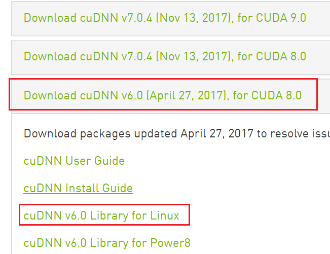
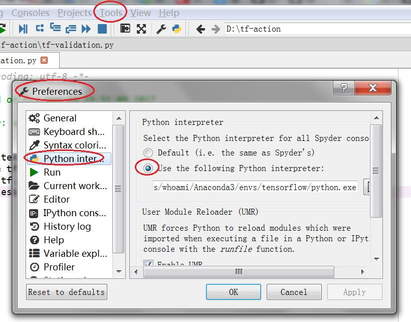

Installing
==============

安装python环境
----------------------
ubuntu中自带python，而还需要安装anaconda的原因是，在安装tensorflow时，建议最好使用anaconda。

安装方法：《tensorflow实战》3.1.1

安装路径：/home/superben/anaconda3

当在cmd中运行python时，会寻找到anaconda的python，因为/home/anaconda/bin添加到了PATH的最前面，shell在找到anaconda的python后，就不会继续寻找unbuntu系统自带的python了。

安装NVIDIA驱动(可省略)
----------------------------
检查是否安装成功
^^^^^^^^^^^^^^^^^^^^^^
甭管系统中是否自带驱动，运行下列命令，如果不能正常显示，那么就得重新安装显卡驱动。

$nvidia-smi #可显示显卡一些信息，显卡的个数等

$nvidia-settings #可以打开显卡设置的图像界面(NVIDIA X Server Settings)

另外还有命令：

.. code-block:: none
	:linenos:

	#显示系统中所有PCI总线设备或连接到该总线上的所有设备的工具
	$lspci | grep VGA 或 lspci | grep NVIDIA
	#已载入系统的模块
	$lsmod | grep nvidia
	$glxinfo | grep render
	#输出：OpenGL renderer string: GeForce GTX 1080 Ti/PCIe/SSE2

on ubuntu16
^^^^^^^^^^^^^^^^^^
1. 查看ubuntu的默认驱动

.. code-block:: none
	:linenos:

	$lspci -v
	OR
	$glxinfo | grep render #从输出中的两行，可以解析四种"rendering/OpenGL/X display"的工作方式

+--------------------+--------------------------------------------------------------------------------------+--------------------------------------------------------------------------------------+
|                    | direct rendering                                                                     | indirect rendering                                                                   |
|                    |                                                                                      |                                                                                      |
|                    | ( all 3D rendering commands are handled by the X client application                  | ( all rendering commands are sent to the X server)                                   |
|                    |                                                                                      |                                                                                      |
|                    |                                                                                      |                                                                                      |
|                    | ,so that the X server is free to service requests from other applications.)          |                                                                                      |
+--------------------+--------------------------------------------------------------------------------------+--------------------------------------------------------------------------------------+
| software rendering | direct rendering: Yes                                                                |                                                                                      |
|                    |                                                                                      |                                                                                      |
|                    | OpenGL renderer string: Software Rasterizer                                          |                                                                                      |
+--------------------+--------------------------------------------------------------------------------------+--------------------------------------------------------------------------------------+
| hardware rendering | direct rendering: Yes                                                                | direct rendering: No (LIBGL_ALWAYS_INDIRECT set)                                     |
|                    |                                                                                      |                                                                                      |
|                    | OpenGL renderer string: Mesa DRI Intel(R) 945GM GEM 20090326 2009Q1 RC2 x86/MMX/SSE2 | OpenGL renderer string: Mesa DRI Intel(R) 945GM GEM 20090326 2009Q1 RC2 x86/MMX/SSE2 |
+--------------------+--------------------------------------------------------------------------------------+--------------------------------------------------------------------------------------+

在我的新装机器中，$glxinfo | grep render输出中的对应行如下,表明使用的是“开源驱动”：

OpenGL rendering string: Gallium 0.4 on llvmpipe (LLVM 4.0, 256 bits)

2. 获取驱动

去官网获取驱动，放在home目录下。

- 产品类型：geforece
- 产品系列：geforce 10 series
- 产品家族：geforce gtx 1080 ti

3. 卸载ubuntu系统中自带的nvidia驱动版本

$sudo apt-get remove --purge nvidia*

4. 编译依赖

执行$uname -r，比如我的结果是4.4.0-98-generic

执行
$sudo apt-get install build-essential pkg-config xserver-xorg-dev linux-headers-4.4.0-98-generic

5. 屏蔽开源驱动nouveau

安装过程会询问是否屏蔽，手动屏蔽也有多种操作方式，如通过blacklist.conf或Grub2。这里选择blacklist：

创建新文件：
$sudo vim /etc/modprobe.d/blacklist-nouveau.conf

内容为

blacklist nouveau

options nouveau modeset=0

再更新$sudo update-initramfs  -u

修改后需要重启系统。

确认下Nouveau是已经被你干掉，使用命令： $lsmod | grep nouveau

6. 结束X-window服务

  安装Nvidia驱动需要结束x-window服务，据说这一步很重要。

按Ctrl + Alt + F1 进入tty1控制台，输入用户名密码登录，然后键入命令后执行（数字不能用小键盘输入）：

$sudo service lightdm stop

7. 安装驱动

执行驱动安装的run文件
$sudo sh ./NVIDIA*.run
（如果安装不正常则带 --uninstall 参数卸载）

- 报错The distribution-provided pre-install script failed!不必理会，继续安装；
- 最重要的一步，安装程序问你是否使用nv的xconfig文件，nvidia-xconfig, 这里一点要选yes，否则在启动x-window时不会使用nv驱动。

8. 重启X 服务

$sudo service lightdm start
（然后Ctrl+Alt+F7进入图形界面，在我的系统中，这一步没有出现）

9. 卸载驱动

sudo sh ~/NVIDIA-Linux-x86_64-367.44.run --uninstall

系统会提示，是否使用nvidia-xconfig --restore-original-backup来恢复以前的x configuration file？
选择Yes

10. 检查

nvidia-smi 可显示显卡一些信息

nvidia-settings 显卡设置

另外还有命令：

.. code-block:: none
	:linenos:

	#显示系统中所有PCI总线设备或连接到该总线上的所有设备的工具
	$lspci | grep VGA 或 lspci | grep NVIDIA
	#已载入系统的模块
	$lsmod | grep nvidia
	$glxinfo | grep render
	#输出：OpenGL renderer string: GeForce GTX 1080 Ti/PCIe/SSE2

11. 安装驱动成功后，界面的分辨率更高了，字号更小了。

on ubuntu18
^^^^^^^^^^^^^^^
这个方法来自于 `How to install the NVIDIA drivers on Ubuntu 18.04 Bionic Beaver Linux <https://linuxconfig.org/how-to-install-the-nvidia-drivers-on-ubuntu-18-04-bionic-beaver-linux>`_

First, detect the model of your nvidia graphic card and the recommended driver. To do so execute:

.. code-block:: none
    :linenos:

    $ubuntu-drivers devices
    == /sys/devices/pci0000:00/0000:00:01.0/0000:01:00.0 ==
    modalias : pci:v000010DEd00001180sv00001458sd0000353Cbc03sc00i00
    vendor   : NVIDIA Corporation
    model    : GK104 [GeForce GTX 680]
    driver   : nvidia-304 - distro non-free
    driver   : nvidia-340 - distro non-free
    driver   : nvidia-384 - distro non-free recommended
    driver   : xserver-xorg-video-nouveau - distro free builtin

    == cpu-microcode.py ==
    driver   : intel-microcode - distro free

From the above output we can conclude that the current system has NVIDIA GeForce GTX 680 graphic card installed and the recommend driver to install is nvidia-384. If you agree with the recommendation feel free to use ubuntu-drivers command again to install all recommended drivers:

**$ sudo ubuntu-drivers autoinstall**

Once the installation is concluded, reboot your system and you are done.

安装CUDA
----------------------------

在下述的ubuntu的两个版本中，在cuda的下载页面都是选择.run安装文件，

on ubuntu16
^^^^^^^^^^^^^^^^^
CUDA安装包里集成了显卡驱动，下载时请选择cuda8.0，否则在import tensorflow时，会报错“找不到*.so.8”。

安装路径/usr/local/cuda-8.0

安装过程见《tf实战》p43

on ubuntu18
^^^^^^^^^^^^^^^^

.. code-block:: none
    :linenos:

	# CUDA 9 requires gcc 6
	sudo apt install gcc-6
	sudo apt install g++-6

	# downoad one of the "runfile (local)" installation packages from cuda toolkit archive 
	wget https://developer.nvidia.com/compute/cuda/9.0/Prod/local_installers/cuda_9.0.176_384.81_linux-run

	# make the download file executable
	chmod +x cuda_9.0.176_384.81_linux-run 
	sudo ./cuda_9.0.176_384.81_linux-run --override

	# answer following questions while installation begin
	# You are attempting to install on an unsupported configuration. Do you wish to continue? y
	# Install NVIDIA Accelerated Graphics Driver for Linux-x86_64 384.81? n
	# Install the CUDA 9.0 Toolkit? y
	# 建立了符号链接 /usr/local/cuda -> /usr/local/cuda-9.2

	# set up symlinks for gcc/g++
	sudo ln -s /usr/bin/gcc-6 /usr/local/cuda/bin/gcc
	sudo ln -s /usr/bin/g++-6 /usr/local/cuda/bin/g++

	# setup your paths
	echo 'export PATH=/usr/local/cuda-9.0/bin:$PATH' >> ~/.bashrc
	echo 'export LD_LIBRARY_PATH=/usr/local/cuda-9.0/lib64:$LD_LIBRARY_PATH' >> ~/.bashrc
	source ~/.bashrc

安装cuDNN
----------------------------
安装过程见《tf实战》p44，在书中的下载页面中登录后，作出如下图的选择，因为

- 如此，下载的就是.tgz格式而非.dep格式的文件
- import tensorflow就不会报错“找不到libcudnn.so.6”

其实，安装cuDNN就是把三个libcudnn.so.*文件放入CUDA的安装路径的库文件夹/usr/local/cuda/lib64下

设置CUDA的路径
----------------------------
过程见《tf实战》p44

安装tensorflow
----------------------------
请参考官方文档 `Installing TensorFlow on Ubuntu <https://www.tensorflow.org/install/install_linux>`_ 下"Installing with Anaconda"

windows anaconda环境下安装tf
----------------------------

官方文档 `install tf on windows with anaconda <https://www.tensorflow.org/install/install_windows#installing_with_anaconda>`_

注意：

- 使用anaconda prompt来执行上述步骤中的命令，而不是windows自带的cmd
- 在第2步，创建tf环境时python的版本一定要选3.5，anaconda会在Anaconda3\\envs\\tensorflow下重新装一个3.5版本的python
- 在anaconda的虚拟环境中安装tf，也要用pip install，而不是conda install
- tf的安装路径，Anaconda3\\envs\\tensorflow\\Lib\\site-packages\\tensorflow

Use tensorflow under Windows&Anaconda
---------------------------------------
tensorflow的一些运行结果需要快速验证，e.g.对于tensor的变换操作。

1. Open Anaconda Prompt
2. Run 'activate tensorflow'
3. Run 'pyhon' to Invoke python
4. Enter programs

配置spyder在tensorflow的虚拟环境中工作
---------------------------------------

1. 在多版本anaconda python环境下转换spyder, https://www.zhihu.com/question/49144687
2. 配置python interpreter

MTCNN在PC/GPU-machine中的路径
-------------------------------
- PC

D:\spyder_project\github\mtcnn\MTCNN-Tensorflow

- GPU-machine

~/tf_action/MTCNN-Tensorflow