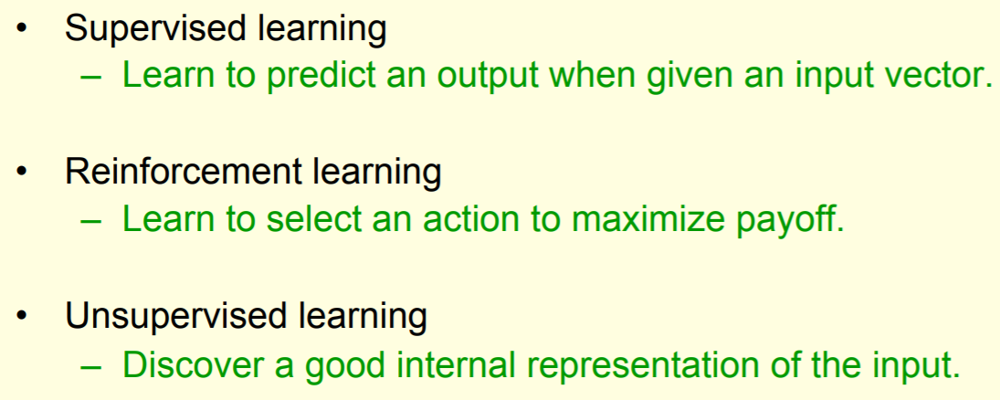
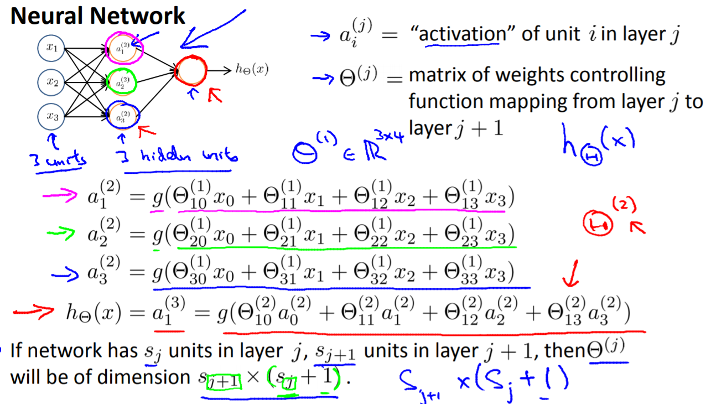

从机器学习到神经网络
=====================

Three types of learning
-------------------------
from hilton week1

当面临实际问题时，这是首先要明确的——适合于哪一种学习：

每一种学习的目的各异，可以详见hilton的讲义。

Two types of supervised learning
^^^^^^^^^^^^^^^^^^^^^^^^^^^^^^^^^^^
1. Regression
2. Classification

回归(regression)问题
------------------------
Andrew Ng在ch2讲解用ML解决回归问题时，用到的例子是“猜房价”，多个features对应着一个值——房屋价格；在人脸识别的landmark detection中，一副图对应着5个坐标，那就是10个值。

- 如果按照ML解决回归问题的思路，得进行10次运算，才能得到face landmark的10个坐标值。
- 在ML中为了提高回归的准确度，往往会构建polynomial hypothesis，如果用一副图的所有像素点作为features来构建polynomial regression，一次计算的参数太多。

分类问题
-----------

1. 在Andres Ng讲解logistic regression时，引入了decision bondary这个概念，从本质上讲，就是features之间的数学关系。当这个数序关系复杂到无法用“多项式”来表示时，只好用神经网络的模型来表示了。
2. 符合不同数学关系的features就属于不同的类别。

+-----------+-----------------------------------------------+------------------+
|           | ML                                            | NN               |
+-----------+-----------------------------------------------+------------------+
| 训练模型  | 拆分为n-1个2分类问题来逐个计算，得到n-1个模型 | 一个模型即可     |
+-----------+-----------------------------------------------+                  +
| 使用模型  | 需要在n-1个模型上分别计算结果，               |                  |
|           | 才能判断到底属于哪个分类。                    |                  |
+-----------+-----------------------------------------------+------------------+
| decision  | features的多项式                              | 用NN的结构和参数 |
|           |                                               | 表示             |
| boundary  |                                               | features之间复杂 |
|           |                                               | 的数序关系       |
+-----------+-----------------------------------------------+------------------+

进化
------
1. 机器学习就像没有hidden layers的神经网络。

2. 即使是hidder layer=1的neural network也能实现在较低计算复杂度（每层的weight个数有该层的neuron units的个数决定）的同时，提高计算精度（等同于构造了复杂的polynomial hypothesis）

上图中的g()表示，这个neuron可能是非linear neuron，可能还会对输入的加权和进行二次处理。