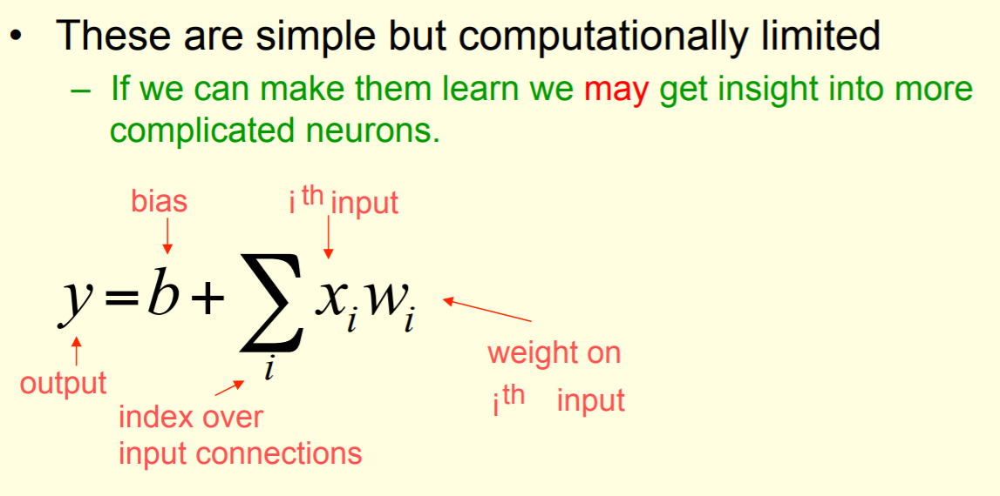
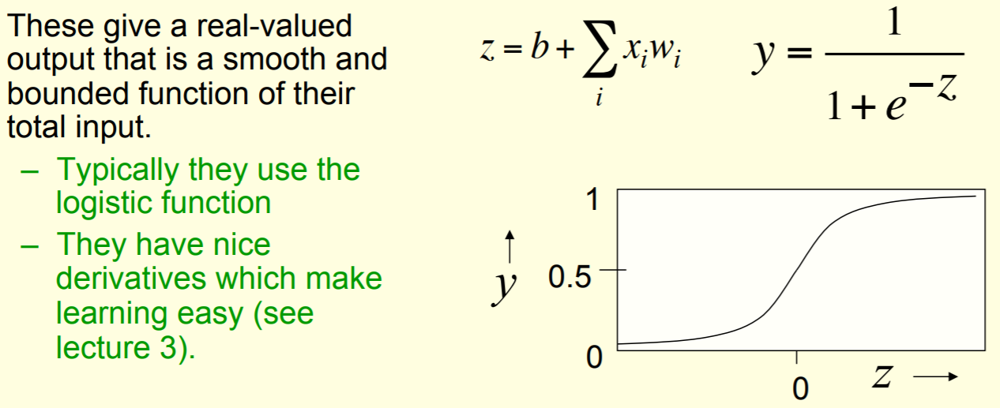
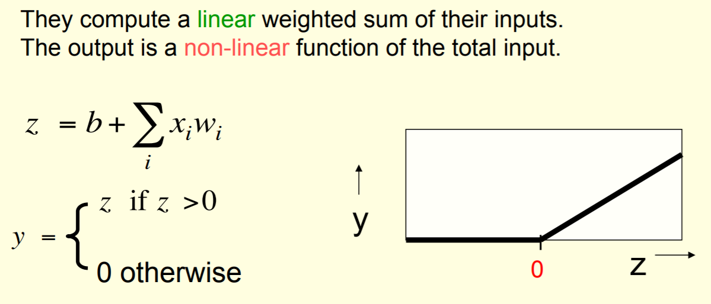
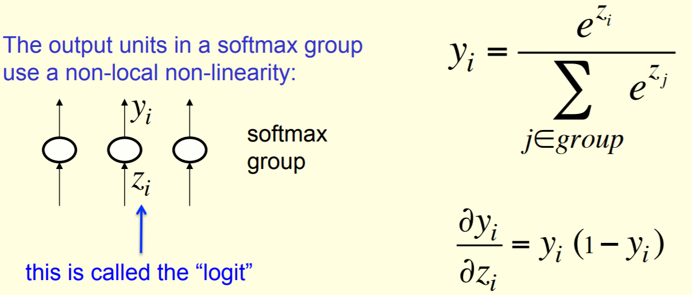

Neuron
==========

根据neuron的激励函数（activation function）不同，常见的neuron model如下。需要根据使用场景选择不同的激活函数或者神经元。

Features of Activation Functions
-------------------------------------
不同的激活函数可能拥有1个或者几个特征，对神经网络的设计和学习过程会带来不同的影响。

- 非线性： 当激活函数是线性的时候，一个两层的神经网络就可以逼近基本上所有的函数了。但是，如果激活函数是恒等激活函数的时候（即f(x)=x），就不满足这个性质了，而且如果MLP（多层感知器，Multilayer Perceptron）使用的是恒等激活函数，那么其实整个网络跟单层神经网络是等价的。
- 可微性： 当优化方法是基于梯度的时候，这个性质是必须的。
- 单调性： 当激活函数是单调的时候，单层网络能够保证是凸函数。
- f(x)≈x： 当激活函数满足这个性质的时候，如果参数的初始化是random的很小的值，那么神经网络的训练将会很高效；如果不满足这个性质，那么就需要很用心的去设置初始值。
- 输出值的范围： 当激活函数输出值是 有限 的时候，基于梯度的优化方法会更加 稳定，因为特征的表示受有限权值的影响更显著；当激活函数的输出是 无限 的时候，模型的训练会更加高效，不过在这种情况小，一般需要更小的learning rate.

How to choose neuron
------------------------
其他复杂的激活函数，都是在“线性神经元”激活函数(a linear weighted sum of the inputs)的基础上进行再次计算得到的。它们肯定在某些方面比activation function of linear neuron做的好？

面对实际问题时，到底是哪些因素决定了neuron的选择。

选择不同的神经元，意味着选了不同的激励函数，这到底对神经网络和计算过程会产生怎样的影响？

Activation functions in TF
-----------------------------
https://www.tensorflow.org/api_guides/python/nn#Activation_Functions

Linear Neuron
----------------

Activation Function
^^^^^^^^^^^^^^^^^^^^^^^^^

Sigmoid Neuron
----------------
这种神经元常用于二分类的深度学习的output layer

Activation Function
^^^^^^^^^^^^^^^^^^^^^^^^^
这种神经元就具有如下4个特征：非线性，单调，可微，值受限。所以，就很好啊，使用很广。

ReLU
----------------
Rectified Linear Neuron

首次应用
^^^^^^^^^^
AlexNet中，除了最后一层softmax，所有的卷积以及全连接输出，都一ReLU为激活函数。以此成功解决了sigmoid在网络较深时的梯度弥撒问题。见，《tf实战》p101

In TF
^^^^^^^^
tf.nn.relu(
    features,
    name=None)

PReLU
----------------
Parametric Rectified Linear Unit，增加了参数修正的ReLU，来自于论文 `Delving Deep into Rectifiers:Surpassing Human-Level Performance on ImageNet Classification <https://arxiv.org/pdf/1502.01852.pdf>`_

.. image:: img/prelu.png

- 在MTCNN的PNet中使用了这个激励函数。
- 注意图中通道的概念，不同的通道对应不同的a :subscript:`i`
- 如果 ai=0，那么 PReLU 退化为 ReLU；如果 ai 是一个很小的固定值（如ai=0.01），则 PReLU 退化为 Leaky ReLU（LReLU）。 有实验证明，与 ReLU 相比，LReLU 对最终的结果几乎没什么影响。
- ReLU只增加了极少量的参数，也就意味着网络的计算量以及过拟合的危险性都只增加了一点点。特别的，当不同 channels 使用相同的 ai 时，参数就更少了。
- 对于任何新增的参数都会涉及两个问题，一是初始化，二是在整个计算过程中是否会变化
- 整个论文，ai 被初始化为 0.25。
- BP 更新 ai 时，采用的是带动量的更新方式（类似于learning rate），如下图：

.. image:: img/prelu-2.png

上式的两个系数分别是动量和学习率。
需要特别注意的是：更新 ai 时不施加权重衰减（L2正则化），因为这会把 ai 很大程度上 push 到 0。事实上，即使不加正则化，试验中 ai 也很少有超过1的。

Softmax Group
----------------
Activation function
^^^^^^^^^^^^^^^^^^^^^

IN TF
+++++++++
tf.nn.softmax(
    logits,
    axis=None,
    name=None,
    dim=None)

其中，logits = tf.matmul(X, W) + bias

bias
--------
对于一个神经元而言，bias是不可或缺的。那么，在tf的实践中，bias是如何加入到神经元的输出中去的呢？

初始化
^^^^^^^^^
把同一层的神经元的bias都初始化成相同的值，有时候是0，或者0.1。

tf.nn.bias_add()
^^^^^^^^^^^^^^^^^^^^^^^
1. 首先计算神经元的“输入线性加权和”，对于CNN而言，就是tf.nn.conv2d()
2. 然后通过调用bias_add()，把bias加到“加权和”上

TF中神经元加权和的计算
-------------------------
在上述所有神经元的激活函数中，加权和是基础，那么在TF中，是如何计算这些加权和的呢？

卷积网络
^^^^^^^^^^^^
两步关键函数如下：

- tf.nn.con2d()
- tf.nn.bias_add()

例如，《tf实战》p88，101

全链接网络
^^^^^^^^^^^^^
两步关键函数如下：

- tf.matmul()
- tf.nn.bias_add()