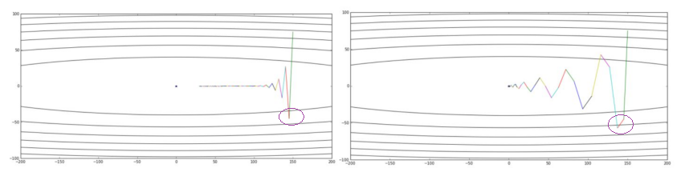
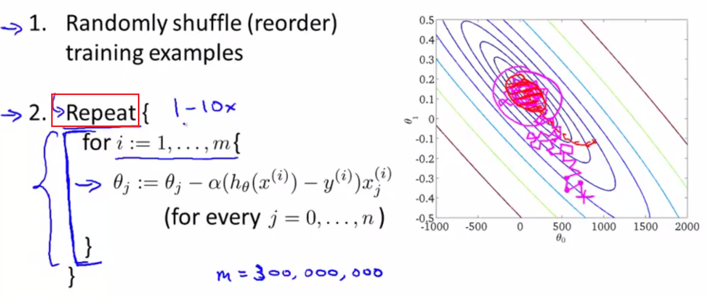

Optimization Algorithm
=========================

What to Optimize
-------------------
最优算法就是寻找cost function最小值的算法

Evaluation the Algorithm
--------------------------

.. _convergence-speed:

Convergence Speed
^^^^^^^^^^^^^^^^^^^
“Convergence Speed”可以定义为：经过多少次iterations，cost function达到最小值。一个拥有更快收敛速度的算法，在error surface的等高线图中的移动路径，可以从Momentum对SGD的改进中看出来。

不同的优化算法比较speed时，可以比较在相同iterations数量下，哪个算法使cost function更加接近最小值，参见 :ref:`SGD v.s. Momentum <sgd-momentum>`

提高某个算法的收敛速度——该快的时候快，该慢的时候慢，例如：

- move quickly in directions with small but consistent(一致性) gradients
- move slowly in directions with big but inconsistent gradients.

Convergent or Not
^^^^^^^^^^^^^^^^^^
**whether the learning goes wrong: convergent or not, global or local minimum**

Plot J :subscript:`train` (θ) as a function of the number of iterations of gradient descent.

- 坐标图中只需要一条曲线就可以判断
- 不同的learning method在曲线取样点的选择上有一些不同（From Andrew Ng Week 10）

Generalization
^^^^^^^^^^^^^^^
Generalization(Andrew Ng), underfit(high bias) or overfit(high variance)

在学习（迭代）的过程中，需要同时画两条曲线，通过对比才能判断。

Accuracy, Precision, Recall&F1 score
^^^^^^^^^^^^^^^^^^^^^^^^^^^^^^^^^^^^^^

Concerns of an Algorithm
---------------------------
算法需要考虑的“因素”包括：

- :ref:`learning method <learning-method>`
- initialization of the weights
- :ref:`the stride of the weight movment <learning-rate>`, 即learning rate
- :ref:`direction of the weight movment <direction-descent>`, e.g. steepest descent的梯度反方向
- regularization, λ(Andrew Ng)

.. _learning-method:

Learning method
^^^^^^^^^^^^^^^^^^
对于神经网络而言，依据训练集的数据特点，有四种常用的学习方法：

full-batch method
++++++++++++++++++

适用于small **datasets** (e.g. 10,000 cases) or bigger datasets without much redundancy（冗余）

.. _mini-batch-method:

mini-batch method
+++++++++++++++++++++

(from Hilton)适用于big, redundant **datasets**, e.g. CNN中使用的图片数据。最好使用 **big mini-batches** ,不仅计算效率高、速度快，而且也满足一些fancy optimiaztion algorithm的需要。

还可以从 :ref:`learning curve <large-scale-data-ps>` 的角度来理解mini-batch的可行性

相关概念：

- epoch
- iteration
- batch size
- number of batches

当一个完整的数据集通过了神经网络一次并且返回了一次，这个过程称为一个 epoch。

迭代是 batch 需要完成一个 epoch 的次数。记住：在一个 epoch 中，batch 数和迭代数是相等的。比如对于一个有 2000 个训练样本的数据集。将 2000 个样本分成大小为 500 的 batch，那么完成一个 epoch 需要 4 个 iteration。

stochastic method
+++++++++++++++++++

Frome Andrew Ng 10th Week，下图来自于Andrew Ng 10th-week

上图中，

- m是数据集的大小。
- Repeat内部的for循环，表示针对每条训练数据，weights都会发生改变。
- 外层的Repeat循环表示上述过程要重复的次数。

online method
++++++++++++++++

(From Andrew Ng 10th week)The online learning setting allows us to model problems where we have a continuous flood or a continuous stream of data coming in and we would like an algorithm to learn from that. 

Online method的算法和stochastic method类似，但是，前者不保存training examples，用过之后即丢弃。

.. _learning-rate:

Learning Rate
^^^^^^^^^^^^^^^^^
How α influence the learning 
++++++++++++++++++++++++++++++++
根据Gradient discent的公式，

.. image:: img/nn-3.png

learning rate的取值大小通过直接影响Weights，进而影响cost function的收敛性，无法兼顾学习速度和收敛结果(是否成功找到cost function的最小值)。

- weights在 **error surface** 中的移动方式，会影响收敛速度和收敛结果
- learning rate太大，就湮没了不同weights分量的梯度的不同，因为是 **learing-rate * gradient**，进而导致收敛速度降低

When&How to adjust α
+++++++++++++++++++++++
目前，有两种常用的调节learning rate的方法：

- 设置初值，根据learning speed再手工调节, e.g. :ref:`SGD <sgd-lr>` , Momentum, Nesterov Momentum
- 自适应, e.g. RMSProp, Adam, AdaGrad

Manual learning rate
+++++++++++++++++++++++

+-------------+-------------------------------------------------------------------+--------------+-----------------+
|             |                               error                               | convergence  |   convergence   |
|             |                                                                   |     speed    |      result     |
+-------------+-------------------------------------------------------------------+--------------+-----------------+
| turn down α | reduce the random fluctuations(随机波动)in the error              | slower       | get a quick win |
|             | due to the different gradients on different mini-batch            |              |                 |
+-------------+-------------------------------------------------------------------+--------------+-----------------+
| turn up α   | weighs slosh to and fro(来回摇摆) across the ravine(峡谷)，如下图 | quick        | failed          |
+-------------+-------------------------------------------------------------------+--------------+-----------------+

.. image:: img/nn-2.png

Adaptive learning rate
++++++++++++++++++++++++
依据是gradient的特征

- gradient符号正负号的转换
- gradient的量值

.. _direction-descent:

Descent Direction
^^^^^^^^^^^^^^^^^^^^
Gradient Oscillation
++++++++++++++++++++++
- 在Hilton的课中多次提到gradient oscillation（振荡），我认为就是梯度的正负号的变化。
- gradient oscillation会改变descent direction，进而影响收敛速度。
- Gradient Oscillation可以在error surface的等高线图中可以清晰的表示出来， `this <https://zhuanlan.zhihu.com/p/21486826>`_ 在对不同的learning rate的SGD之间，以及SGD和Momentum之间进行比较时，图示了Gradient Oscillation
- 梯度之所以为oscillation的原因，在上述链接的例子中，当y移动到负值时，根据梯度公式，cost function在这一点的梯度就取负值了。

The Direction of steepest descent
++++++++++++++++++++++++++++++++++++++
0. network's cost function下降的方向是由每个Δw决定的，可由等高线, :ref:`Error Surface <error-surface>` ,上w的移动看出来。

1. cost function的值下降最快的方向就是梯度的反方向。

2. 有两种gradient(From Hilton)

- small but consistent(一致性) gradients
- big but inconsistent gradients.

（quickly和slowly是如何量化的呢？——learning rate）

Other directions of cost function descent
++++++++++++++++++++++++++++++++++++++++++++

Generalization
---------------
How To Judge
^^^^^^^^^^^^^^
有很多防止overfit的方法，但是首先要判断是否发生了overfit，并辨别成因，使用对应的解决方法。

显然，只有把train set和validation set的cost function曲线放在一起，才能判断是否发生了ovefit。

L1 Regularization
^^^^^^^^^^^^^^^^^^^
.. image:: img/l1-reg.png

L2 Regularization
^^^^^^^^^^^^^^^^^^^
.. image:: img/l2-reg.png

Dropout
^^^^^^^^^
详见 :ref:`CNN-Dropout <dropout>`

.. _data-aug:

Data Augmentation
^^^^^^^^^^^^^^^^^^
`this article <http://blog.csdn.net/u012162613/article/details/44261657>`_ 中的“数据集扩增”部分讲的很好，还有相关论文，暂时没有时间看。

`the article <https://zhuanlan.zhihu.com/p/31761796>`_ 详述了对MTCNN中所使用的"data set"进行data augmentation的过程

LRN
^^^^^^^
LRN,局部响应归一化，AlexNet首次引入。用在神经网络结构中的哪里呢？

作用：对局部神经元的活动创建竞争机制，使得其中响应比较大的值变得相对更大，并抑制其他反馈较小的neuron，增强了模型的泛化能力。

Training
----------
Definition
^^^^^^^^^^^^
其实，神经网络的训练过程就是使用Optimization Algorithm最小化Loss的过程。

Epoch&Iteration
^^^^^^^^^^^^^^^^^
- epoch
- iteration
- batch size
- number of batches

当一个完整的数据集通过了神经网络一次并且返回了一次，这个过程称为一个 epoch。

迭代是 batch 需要完成一个 epoch 的次数。记住：在一个 epoch 中，batch 数和迭代数是相等的。比如对于一个有 2000 个训练样本的数据集。将 2000 个样本分成大小为 500 的 batch，那么完成一个 epoch 需要 4 个 iteration。

Instance 
----------
一个算法可能就出自一篇论文。

总览
^^^^^
`An overview of gradient descent optimization algorithms <http://ruder.io/optimizing-gradient-descent/index.html>`_

SGD
^^^^^^
1. 随机梯度下降，Stochastic Gradient Descent，又可以称为mini-batch gradient descent
2. 使用一小部分样本进行训练
#. MNIST training set只有55000个样本，下面的例子却使用总数为100万的训练样本数量

.. code-block:: python
  :linenos:

  #return an operation
  train_step = tf.train.GradientDescentOptimizer(learning-rate).minimize(loss-function)
  for i in range(20000):
    batch = mnist.train.next_batch(50)
    train_step.run(feed_dict={x:batch[0], y_:batch[1]})

.. _sgd-lr:

4. manual adjust **learning rate** to mini-batch gradient descent

- if the error keeps getting worse or oscillates wildly, **reduce** the learning rate
- towards the end of learning it nearly always helps to **turn down** the learning rate
- when error stops decreaseing, **turn down** the learning rate
- if the error is falling fairly consistently bust slow, **increase** the learning rate
    

BGD
^^^^^
batch gradient descent，传统的梯度下降每次使用全部样本进行训练

Momentum
^^^^^^^^^^^

1. Momentum改进自SGD算法。
2. 计算公式的改变之处可以参见《Hilton lecture6》或者 `An overview of gradient descent <http://ruder.io/optimizing-gradient-descent/index.html#momentum>`_ , 这两者在求取v(t)时所使用的signs相反，应该无影响。

- 在求ΔW时，没有采用"steepest descent"（问题是，没有沿着梯度的方向，为什么还能加速？）
- Hilton says(lecture 6c) it can speed up mini-batch learning, 但是代价是引入了一个新的“动量衰减参数”
- 一个已经完成的梯度+步长的组合不会立刻消失，只是会以一定的形式衰减，剩下的能量将继续发挥余热。

3. Momentum相比于SGD速度更快且振动减小了，体现在两个方面，如下图

- 从横轴看，The momentum term increases for dimensions whose gradients point in the same directions
- 从纵轴看，The momentum term reduces updates for dimensions whose gradients change directions. 

.. _sgd-momentum:

SGD&Momentum&NAG
++++++++++++++++++
`ref <https://zhuanlan.zhihu.com/p/21486826>`_ 给出了SGD&Momentum&NAG的比较，提炼如下：

- 用了一个等高线是椭圆的cost function作为取最值的对象，而可以通过对dataset的预处理让等高线尽量圆一点。
- 用等高线坐标系中weights的移动轨迹使优化的过程可视化。
- 给出了三幅图，说明使用SGD时，如果只是单纯的加大learning rate，1)收敛速度不一定会增加，反而可能根本无法收敛;2)gradient oscillation并没有改变。
- 比较SGD和Momentum的weights的运动轨迹时，最大的区别就是“使得梯度下降的的时候转弯掉头的幅度不那么大了，于是就能够更加平稳、快速地冲向局部最小点”。

NAG
^^^^^
https://zhuanlan.zhihu.com/p/22810533

Nesterov Accelerated Gradient，简称NAG。它仅仅是在Momentum算法的基础上做了一点微小的工作，形式上发生了一点看似无关痛痒的改变，却能够显著地提高优化效果。

Rprop
^^^^^^^
1. Hilton lecture6
2. use a full-batch method
3. use adaptive learning rates

引入了一个新的参数——local gain, g, α->α*g

Rmsprop
^^^^^^^^^
1. Hilton lecture6
2. use mini-batch method
#. use adaptive learning rates

Adam
^^^^^
1. use momentum
2. use mini-batch method
3. adaptive learning rates