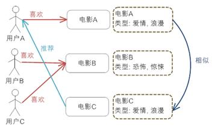

推荐系统
==========
参考链接
---------
https://www.ibm.com/developerworks/cn/web/1103_zhaoct_recommstudy1/index.html

一、基于用户的相似度推荐
------------------------
有两个方法实现。

1. 基于用户的协同过滤推荐(CF)
^^^^^^^^^^^^^^^^^^^^^^^^^^^^^
在用户的历史偏好的数据上计算用户的相似度，基本假设是，喜欢类似物品的用户可能有相同或者相似的口味和偏好。

2. 基于人口统计学的推荐
^^^^^^^^^^^^^^^^^^^^^^^^^
假设，基本信息相似的用户有相似的口味。

二、基于物品相似度预测推荐
----------------------------
有两种相似度计算方法。

1. 基于项目的协同过滤推荐（CF）
^^^^^^^^^^^^^^^^^^^^^^^^^^^^^^^^
场景：amazon的捆绑销售 (Frequently Bought Together): 采用数据挖掘技术对用户的购买行为进行分析，找到经常被一起或同一个人购买的物品集，进行捆绑销售，这是一种典型的基于项目的协同过滤推荐机制。

2. 基于内容的推荐
^^^^^^^^^^^^^^^^^^^

场景：amazon的新产品的推荐 (New For You): 采用了基于内容的推荐机制 (Content-based Recommendation)，将一些新到物品推荐给用户。在方法选择上由于新物品没有大量的用户喜好信息，所以基于内容的推荐能很好的解决这个“冷启动”的问题。

三、基于模型的协同过滤推荐
---------------------------
它有以下几个显著的优点：

1. 它不需要对物品或者用户进行严格的建模，而且不要求物品的描述是机器可理解的，所以这种方法也是领域无关的。

2. 这种方法计算出来的推荐是开放的，可以共用他人的经验，很好的支持用户发现潜在的兴趣偏好