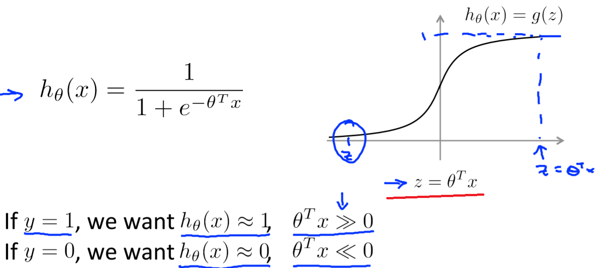
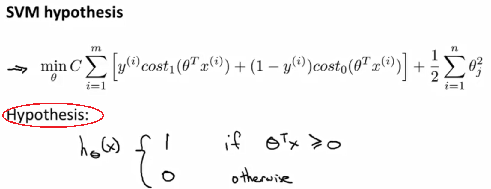
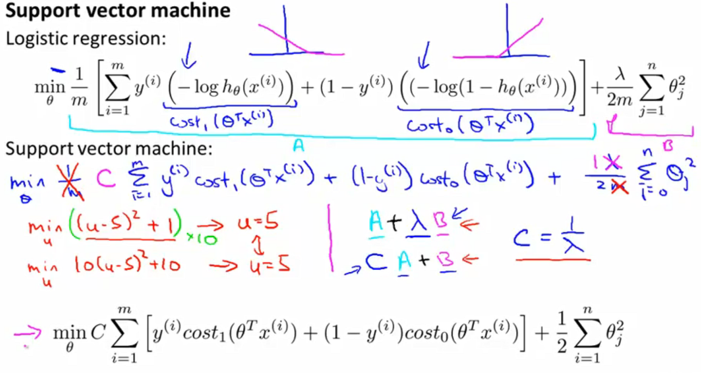
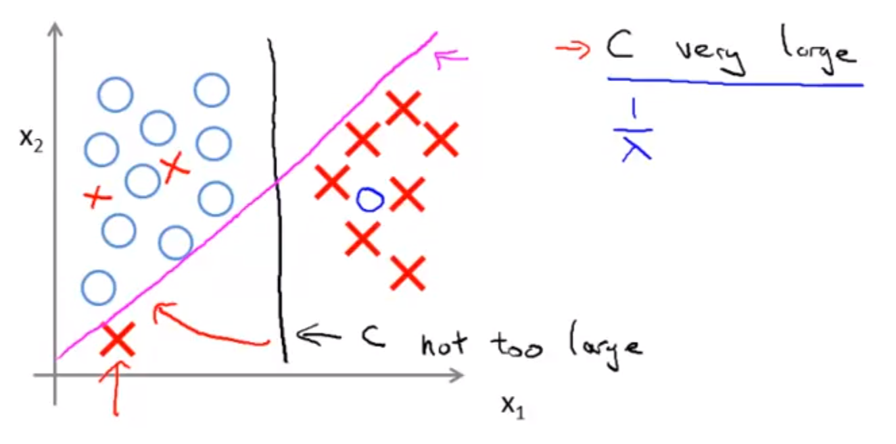
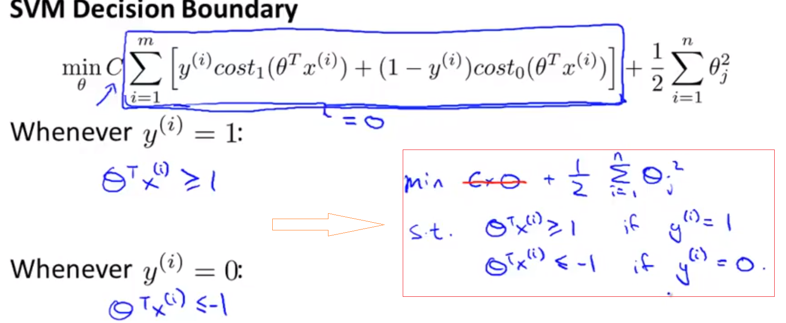
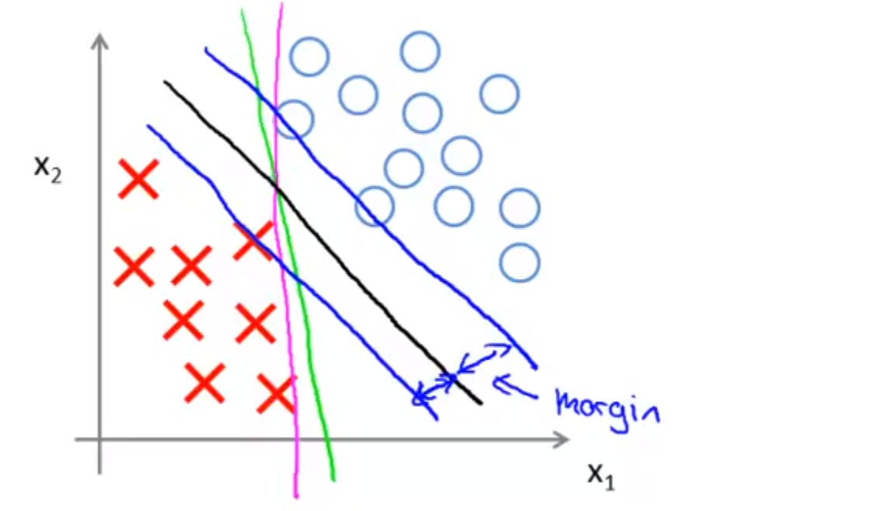
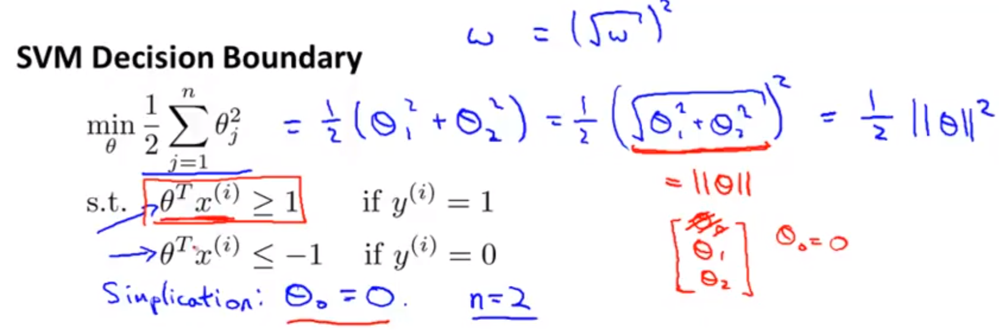
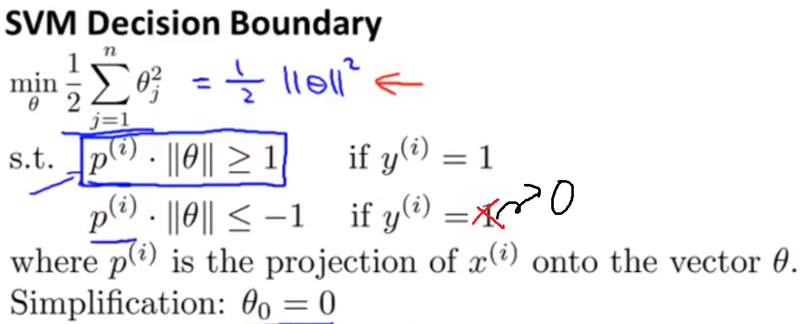
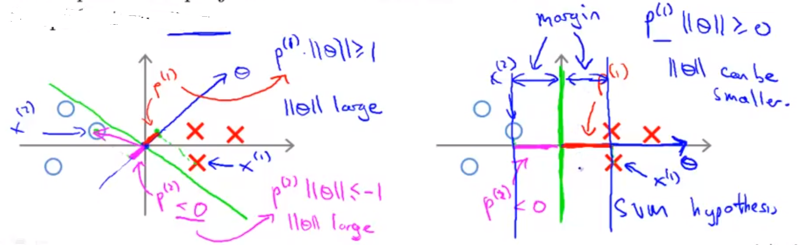
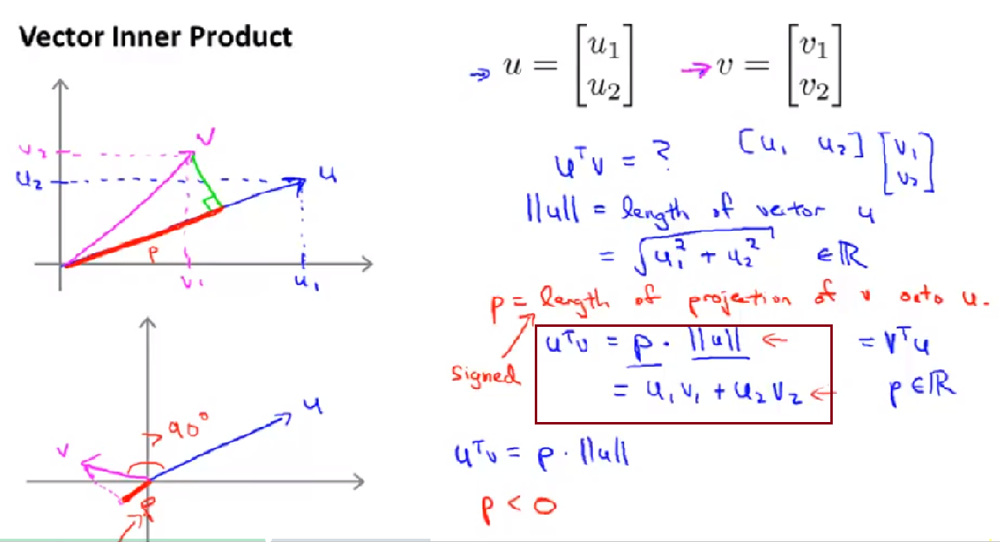

SVM
=======
SVM vs Logistic Regression vs Neural Network
-------------------------------------------------
1. 3种方法都可用于“监督学习”中的“分类问题”，根据"number of features"和"numbers of training examples"的相对关系做出选择，详见《ML 笔记》 week7 p63

2. SVM和LR更像，在一些方面作了简化，在另外的方面进行了强化：

- 在cost function和hypothesis上做出了简化；
- 在对features处理上进行了强化（主要目的是为了适应上述2个方面的简化）。

3. 和另外2个机器学习方法一样，SVM也会存在overfitting/underfitting的问题，只是影响因素不同了。

features
-----------
+----------------+-----------------------+----------------------------+
|                | logistic regression   | SVM                        |
+----------------+-----------------------+----------------------------+
| 不扩充features |                       | linear kernel              |
+----------------+-----------------------+----------------------------+
| 扩充features   | high order polynomial | kernel/similarity function |
+----------------+-----------------------+----------------------------+

Kernels
^^^^^^^^^^^
是否需要使用“kernels”/“similarity functions”，要看“features个数”和“训练例子个数”的相对多少来决定，详见《ML NOTES》p63

要使用kernels，有几个关键点：

- 一个training example和一个landmark经过similarity function计算后，得到一个new feature值
- landmarks，其数量就是new features的维度，如何选择landmarks见《ML》p60
- similarity function,定义了new features的计算方法，常用的是“高斯kernel”，函数定义见《ML》p59

hypothesis
-------------
1. LR的hypothesis如下图所示

2. SVM的hypothesis如下图所示

- svm的hypothesis不像LR输出的是probability，而是make a prediction of y=1 or 0 directly.
- 公式中的X即可能是original kernel，又可能是经过kernel function扩维后的new features.
- 所谓decision boundary就是公式中的 Θ :superscript:`T` x

cost function
----------------

- SVM对LR的cost function进行了简化
- 公式中的X即可能是original kernel，又可能是经过kernel function扩维后的new features.

bias & variance
-------------------
SVM的underfitting/overfitting会受到下列因素的影响，《ML》p61：

1. cost function中的regularity parameter——C

"C"对于bias和variance的影响，在视频的"Large Margin Intuition"小节中，通过C的大小对"decision boundary"的影响，可以视觉化的看到。

- C very large导致SVM对outliers敏感，decision boundary会由“黑色线”变成“紫色线”
- C not too large，SVM会忽略outliers

2. similarity functiong中的参数，例如“高斯kernel”中的σ(sigma)

Large Margin Classfier
--------------------------
1. Margin: distance between decision boundary and examples.

2. SVM又称为Large Margin Classfier,为什么说SVM的cost function是large margin的原因?如下图，SVM的optimization object满足一定的条件时发生了变化。

由上图的cost function求得的Θ构成的decision boundary就会是下图的“黑色线”，而不是“绿色”或“紫色”

3. 下面2副图是SVM的optimization object使用向量内积时的转化

而且，下面这副图说明了，既要使||Θ||最小化，又要满足constraints对于||Θ||取值范围的限定，只能是 **projection** 尽量大，所以SVM选择下图右侧的绿色的decision boundary。

数学含义
-----------------
用向量内积来理解optimization object of SVM

向量内积有2种计算方式，当两个向量的夹角>90时，是负数，如下图

在讲义中例子是vector，如果是多维数组的内积呢？