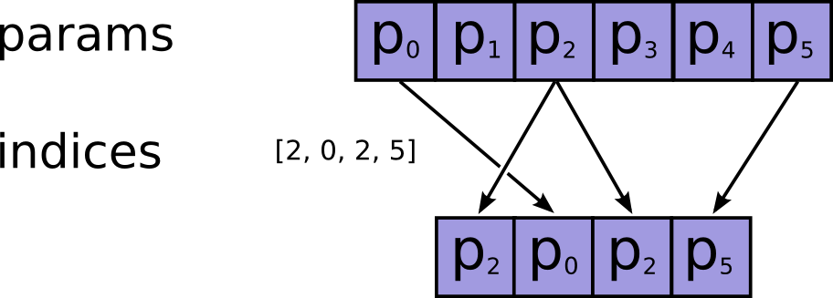

Tensor
=======

what's tensor
---------------
Very briefly, a tensor is an N-dimensional array containing the same type of data (int32, bool, etc.): All you need to describe a tensor fully is:

1. its data type and 
2. the value of each of the N dimension.

Tensor Type
--------------
Represents the type of the elements in a Tensor. `tf.DType <https://www.tensorflow.org/api_docs/python/tf/DType>`_

Tensor-like objects
--------------------
tf中有5种 `tensor-like objects <https://www.tensorflow.org/programmers_guide/graphs#tensor-like_objects>`_ ,它们在进入operation进行计算时，都将被转换为tf.Tensor

The shape of numpy's array
----------------------------
https://stackoverflow.com/questions/22053050/difference-between-numpy-array-shape-r-1-and-r

tensor shape and tensor rank
------------------------------
+------+-----------+------------------+---------------------------------------+-------+
| rank | dimension |     数学实例     |               python例子              | shape |
+------+-----------+------------------+---------------------------------------+-------+
|   0  |    0-D    |  纯量 (只有大小) |                s = 483                |   []  |
+------+-----------+------------------+---------------------------------------+-------+
|   1  |    1-D    | 向量(大小和方向) |          v = [1.1, 2.2, 3.3]          |  [3]  |
+------+-----------+------------------+---------------------------------------+-------+
|   2  |    2-D    |   矩阵(数据表)   | m = [[1, 2, 3], [4, 5, 6], [7, 8, 9]] | [3,3] |
+------+-----------+------------------+---------------------------------------+-------+

Manipulate the Shape
----------------------
Get the Size of Tensor
^^^^^^^^^^^^^^^^^^^^^^^^
得到tensor所有元素的总个数， `tf.size() <https://www.tensorflow.org/api_docs/python/tf/size>`_

Change the Tensor Shape 
^^^^^^^^^^^^^^^^^^^^^^^^^
- `tf.reshape() <https://www.tensorflow.org/api_docs/python/tf/reshape>`_
- tf.squeeze()，把tensor的shape中值为1的维度去掉

返回tensor's shape
^^^^^^^^^^^^^^^^^^^^
.. code-block:: python
  :linenos:

  t = tf.constant([[[1, 1, 1], [2, 2, 2]], [[3, 3, 3], [4, 4, 4]]])
  tf.shape(t)  # [2, 2, 3]

返回tensor's rank
^^^^^^^^^^^^^^^^^^^
.. code-block:: python
  :linenos:

  # shape of tensor 't' is [2, 2, 3]
  t = tf.constant([[[1, 1, 1], [2, 2, 2]], [[3, 3, 3], [4, 4, 4]]])
  tf.rank(t)  # 3

Manipulate the Type
--------------------
Cast the Type of Tensor
^^^^^^^^^^^^^^^^^^^^^^^^^^
- `tf.cast() <https://www.tensorflow.org/api_docs/python/tf/cast>`_
- tf.to_int32()

.. code-block:: python
  :linenos:

  x = tf.constant([1.8, 2.2], dtype=tf.float32)
  tf.cast(x, tf.int32)  # [1, 2], dtype=tf.int32

Manipulate the Element
------------------------
获得tensor某个维度上的最值的index
^^^^^^^^^^^^^^^^^^^^^^^^^^^^^^^^^
.. code-block:: python
  :linenos:

  tf.argmax(input_tensor, axis)

从Tensor中摘取数据
^^^^^^^^^^^^^^^^^^^
- tf.gather()，从一个tensor(params)的指定维度(axis)的指定位置(indices)获取element，组合成一个tensor

- tf.where(
    condition,
    x=None,
    y=None,
    name=None),从两个tensor,x,y,中选取element/row，组合成一个tensor

矩阵相乘
^^^^^^^^^
.. code-block:: python
  :linenos:

  tf.matmul(h_pool, W)

用于全连接的神经网络, e.g.CNN中的全连接层

矩阵按元素相乘
^^^^^^^^^^^^^^^
.. code-block:: none
  :linenos:

  matrix_1 * matrix_2

矩阵按行/列求和
^^^^^^^^^^^^^^^^
.. code-block:: python
  :linenos:

  tf.reduce_sum(matrix, axis)

其中，

- axis=0, 按列
- axis=1, 按行
- axis=None, all dimensions are reduced, and a tensor with a single element is returned. 

element-wise 比较两个tensor
^^^^^^^^^^^^^^^^^^^^^^^^^^^^
.. code-block:: python
  :linenos:

  equal(
      x,
      y,
      name=None
  )

找出tensor中每行(last dimension)最大的k个数
^^^^^^^^^^^^^^^^^^^^^^^^^^^^^^^^^^^^^^^^^^^^
tf.nn.top_k(), tutorial and `examples <https://www.jianshu.com/p/343c2eaacd18>`_

Evaluating Tensors
---------------------
Evaluating tensor和executing a graph是一个意思。

name
-----
按照一定的规则，由 :ref:`operation's name <ops-name>` 来决定。

A tensor name has the form "<OP_NAME>:<i>" where:

- "<OP_NAME>" is the name of the operation that produces it.
- "<i>" is an integer representing the index of that tensor among the operation's outputs.

Create a Tensor
-----------------
- tf.range()
- tf.zeros(shape,dtype=tf.float32,name=None)
- tf.zeros_like(tensor,
    dtype=None,
    name=None,
    optimize=True)