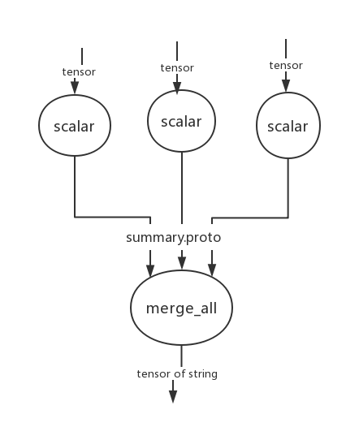

TF Visualization
==================
Package
------------------
Package **summary**, `on github <https://github.com/tensorflow/tensorflow/tree/r1.6/tensorflow/python/summary>`_, provide a way to **export condensed information about a model**, which is then accessible in tools such as TensorBoard.

这个包用于TensorFlow Event Processing, and  is primarily being developed to support **TensorBoard**, but it can be used by anyone who wishes to analyze or visualize TensorFlow **events files**.

How to write event file
--------------------------
1. 定义可视化参数

Create Summary Ops(`on tf-guide <https://www.tensorflow.org/api_guides/python/summary#Generation_of_Summaries>`_) and add them to the collection of GraphKeys.SUMMARIES

.. code-block:: python
	:linenos:

	tf.summary.scalar(name="cls_loss", tensor=cls_loss_op)
	tf.summary.scalar(name="bbox_loss", tensor=bbox_loss_op)
	tf.summary.scalar(name="landmark_loss", tensor=landmark_loss_op)
	tf.summary.scalar(name="cls_accuracy", tensor=accuracy_op)
	summary_op = tf.summary.merge_all(key=tf.GraphKeys.SUMMARIES, scope=None)

2. Creates a FileWriter

The FileWriter class provides a mechanism to create an event file in a given directory.

注意：(和tf.TFRecordWriter()的命名比较)并非tf.event.FileWriter()或者tf.EventWriter()。

.. code-block:: python
	:linenos:
    
	# Launch the graph in a session.
	sess = tf.Session()
	# Create a summary writer, add the 'graph' to the event file.
	writer = tf.summary.FileWriter(<some-directory>, sess.graph)

3. Add data to summaries

在没有运行的时候这些操作是不会执行任何东西的，仅仅是定义了一下而已。

.. code-block:: python
	:linenos:

	for step in range(MAX_STEP):
	  _,_,summary = sess.run([summary_op])#for each iteration

4. Write event protocol buffers to event files

class FileWriter updates the file contents asynchronously. This allows a training program to call methods, **add_xxx()**, to add data to the file directly from the training loop, without slowing down training.

注意:

- add_xxx()仅仅是向FileWriter对象的缓存中存放event data, 而向disk上写数据是由FileWrite对象控制的。
- add_xxx()并非在sess.run()中执行。

.. code-block:: python
	:linenos:

	writer.add_summary(summary,global_step=step)

5. flush

.. code-block:: python
	:linenos:

	#Call this method to make sure that all pending events have been written to disk.
	writer.flush()

6. 涉及的protcol buffer

